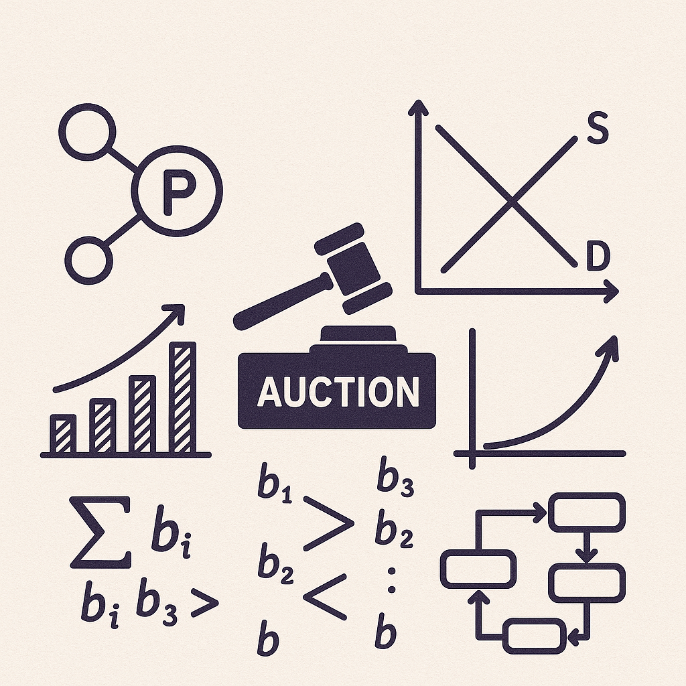

Polkadot uses a [candle auction format](https://wiki.polkadot.network/docs/en/learn-auction) to allocate parachain slots. A candle auction is a dynamic auction mechanism characterized by a randomly ending time. At Web3 Foundation, we have analyzed how such a random-closing rule affects equilibrium behavior, particularly in scenarios where bidders have front-running opportunities.

Front-running opportunities can arise on blockchains when upcoming transactions become visible to network participants before they are included in new blocks. In the context of blockchain auction implementations, this allows certain bidders to observe and potentially respond to others' bids before those bids take effect, such as when they are recorded on-chain and incorporated into the auction mechanism. In first-price auctions, this enables tech-savvy bidders to outbid competitors at will. In second-price auctions, an auctioneer could increase the payment of the winning bidder at no cost by registering their own (pseudonymous) bidder.

While cryptographic solutions to these problems exist, they are either computationally intensive or require multiple actions by the bidders. In the presence of smart contracts, such approaches fail altogether, as smart contract actions are fully predictable. As an alternative to encrypted bidding, we propose a dynamic, single-unit first-price auction with a random ending time. Time is modeled discretely, and in each round, two bidders move sequentially in a fixed order. A random-closing rule not only revenue-dominates a hard-closing rule but also makes participation more attractive for bidders subject to front-running. In particular, under a uniform ending time distribution, both the utility of the disadvantaged bidder and the total revenue converge toward those of a second-price auction as the number of rounds increases. Furthermore, the good is allocated efficiently.

Reference:
Samuel Häfner and Alistair Stewart (2021): Blockchains, Front-Running, and Candle Auctions. Working Paper. [SSRN](https://papers.ssrn.com/sol3/papers.cfm?abstract_id=3846363)

**For inquiries or questions please contact** [Alistair Stewart](team_members/alistair.md)
