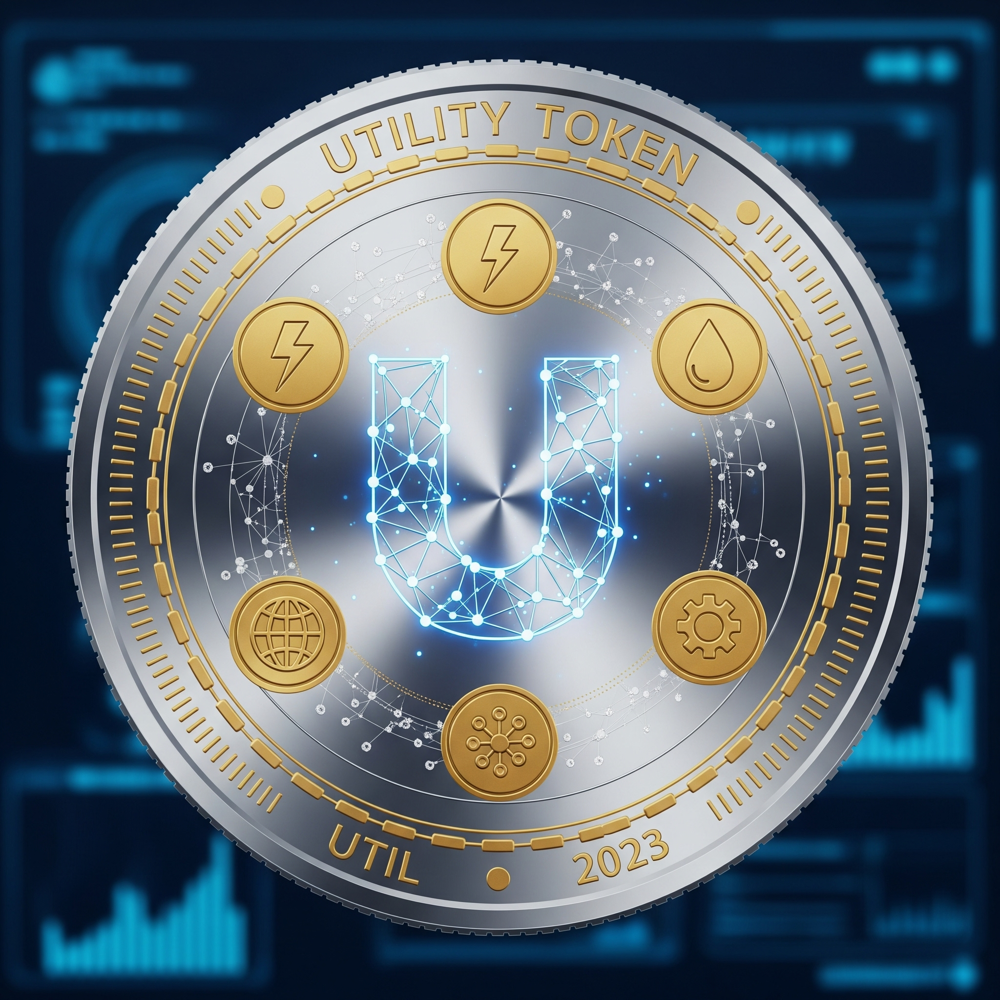

Utility tokens are cryptographic tokens primarily used to access and consume services offered by the token issuer. General design principles for utility tokens native to proof-of-stake blockchains are analyzed in this [project](https://papers.ssrn.com/sol3/papers.cfm?abstract_id=3954773).  

The Polkadot network provides services through parachain slots, which offer shared security and interoperability with other parachains. To secure a slot, users (namely the teams building on Polkadot) must stake DOTs tokens in recurring slot auctions.  

The analysis required a dynamic general equilibrium model of utility tokens, which served as a medium for consuming services on a two-sided market platform.

On the one side of the platform, users derive utility from consuming the services it provides. On the other side, validators supply the necessary security and are compensated with tokens. Validators must regularly sell a portion of their tokens to cover operational costs, while users must continually purchase tokens to access services. A token market facilitates the balance between token supply and demand.

The main results of the analysis are as follows: First, utility token markets are generally efficient, as they lead to the socially optimal provision of services. Second, a key tension has been identified between the dynamics of utility token value, specificaly between the evolution of the services provided, and the payment mechanisms on the users’ side. 

**For inquieries or questions please contacts**: Samuel Häfner

