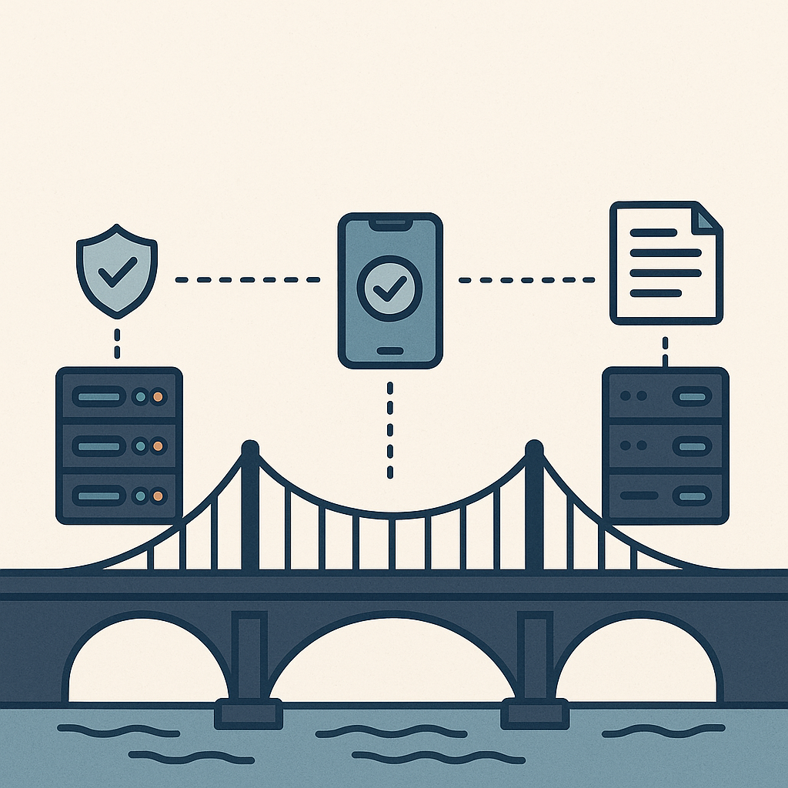

# Accountable Light Client Systems for Secure and Efficient Bridges

One of the key challenges in blockchain interoperability is establishing an efficient and secure on-chain light client protocol. To address this, researchers at the Web3 Foundation present a [protocol](https://eprint.iacr.org/2022/1205) that generates short proofs of the state of a decentralised consensus, while also enabling detection of misbehaving parties. 

A straightforward, albeit naive, approach would require the verifier to maintain an up-to-date list of all participants' public keys, resulting in lengthly proofs. While existing solutions adopt this method, they often suffer from inefficiencies or a lack of accountability. 

To mitigate the challenge at hand, a committee key scheme is designed to produce short proofs that omit plain public keys of individual participants. This scheme incorporates a custom-designed SNARK that enables fast proving times. Leveraging this cryptographic construction, it is possible to build an accountable light client system that can serve as the main core for cross-chain bridges between proof of stake blockchains. A prototype of the custom SNARK, along with corresponding benchmarks, is [available](https://github.com/w3f/apk-proofs) for exploration.

More concretely, the solution described above can be used to build a BLS-based bridge between Kusama and Polkadot. The light client verifier of any such bridge would be [GRANDPA-based](https://github.com/paritytech/grandpa-bridge-gadget/blob/master/docs/beefy.md). If designed naively, the bridge would require verifying hundreds of signatures for every justification. By aggregating BLS signatures, the verification process can be reduced to a single operation against hundreds of public keys. The solution linked above eliminates the need to transmit either hundreds of public keys or individual signatures.

Classical BLS signatures, as described for example in [Chapter 15.5, construction 15.5.3.2.](http://toc.cryptobook.us/book.pdf), offer fast verification for aggregated signatures, yet relatively slow verification for individual ones. 

Since the accountable light client system (linked above), and by extension the bridge design, benefits from BLS signatures offering efficient verification for both individual and aggregated cases, the [proposal](https://eprint.iacr.org/2022/1611) introduces a three-part optimization that dramatically reduces CPU time in large distributed systems that use BLS signatures. 
1. **Dual-group public keys:**  Public keys should be provided on both source groups, accompanied by proof-of-possession checks to ensure correctness. 
2. **Aggregate pulic keys in the second group:** Aggregated BLS signatures should include their specific aggregate public key in the second source group. This enables verifiers to perform both hash-to-curve operations and aggregate public key checks in the first source group. 
3. **Efficient individual verificaton:** Individual (non-aggregated) BLS signatures should include short [Chaum-Pedersen DLEQ proofs of correctness](https://link.springer.com/content/pdf/10.1007/3-540-48071-4_7.pdf). This eliminates the need for pairings when verifying individual signatures, significantly accelerating their validation. 

The security of these optimizations has been formally proven. Moreover, the proposed scheme has been fully implemented and benchmarked, demonstrating clear improvements over the classical BLS scheme.

**For inquieries or questions, please contact** [Bhargav Nagaraja Bhatt](/team_members/bhargav.md)
