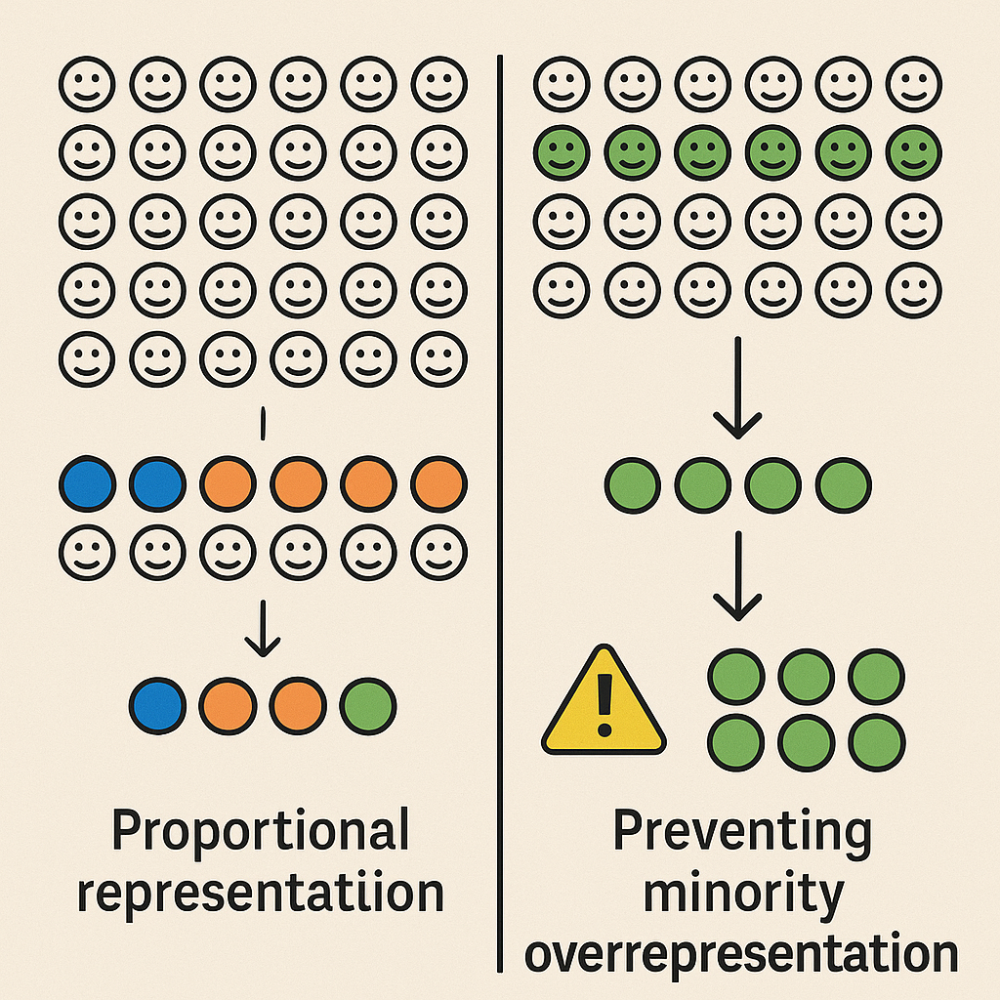

**Abstract.** Proportional representation in approval-based committee elections, an idea explored in social choice literature for over a century, is traditionally understood as a mechanism for avoiding the underrepresentation of minorities. In this paper, we argue that the security of some distributed systems hinges on the opposite goal: preventing the overrepresentation of any minority. To date, this objective has not been formally defined. 

This perspective leads us to an optimization objective known as *maximin support*. Through a detailed analysis of its approximability, we propose a new, efficient election rule inspired by Phragmén's methods. Such a rule provides a) a constant-factor approximation guarantee for the objective, and b) satisfaction of *proportional justified representation* (PJR). 

A notable feature of the proposed rule is that its output can be *verified* in linear time to meet both the maximin support and PJR criteria, even if the algorithm is executed by an untrusted party who communicates only the output. Finally, we present an efficient post-computation step that, when combined with any approximation algorithm for maximin support, yields a new solution that preserves the approximation guarantee and can be efficiently verified to satisfy PJR.

Our work is motivated by a blockchain application that implements *Nominated Proof-of-Stake*, in which the community elects a committee of validators to participate in the consensus protocol. In this setting, preventing overrepresentation is critical to protecting the network from attacks by adversarial minorities. 

The proposed election rule gives rise to a validator election protocol with formal guarantees of both security and proportionality. Crucially, the ability to efficiently verify these guarantees for the winning committee is key to adapting the protocol to the trustless and resource-limited environment of blockchains. We present implementation details in the Polkadot network, which was launched in 2020.

**[arXiv link to reseach paper](https://arxiv.org/abs/2004.12990)**

**For inquieries or questions, please contact** [Alistair Stewart](/team_members/alistair.md)