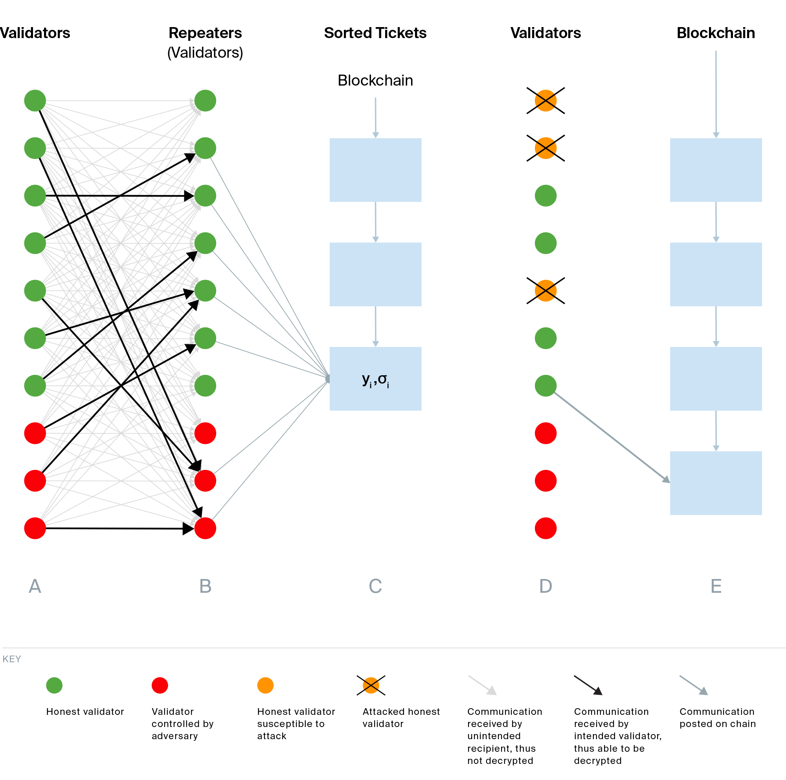

# Sassafras Part 1: A Novel Single Secret Leader Election Protocol 

Authors: Armando Caracheo, Elizabeth Crites, and Fatemeh Shirazi

Polkadot is set to replace the [BABE](https://wiki.polkadot.network/docs/learn-consensus#block-production-babe)+[Aura](https://openethereum.github.io/Aura.html) consensus protocol with a new one: *Sassafras*. Sassafras will be used to generate blocks on Polkadot's relay chain, but can be used in other proof-of-stake (PoS) blockchains as well. So, what key advantages does this new protocol bring to the blockchain ecosystem?

Imagine a bread factory where loaves are produced at random time intervals and multiple conveyor belts may release bread simultaneously, but only one loaf can be packaged at once. Clearly, this is not the most efficient way to process as much bread as possible. In a way, what happens in this factory resembles the current state of block production in Polkadot, as well as in other PoS blockchains.

Classical proof-of-stake protocols for block generation create new blocks at unpredictable intervals, due to having multiple eligible block producers at once, or none at all. [BABE](https://wiki.polkadot.network/docs/learn-consensus#block-production-babe) similarly relies on randomized block generation and therefore inherits these traits. Just like in the bread factory, where the system could benefit from fixed-time production and a single conveyor belt, allowing loaves to be packaged one after another, an optimized block generation mechanism should rely on constant-time intervals and a single block producer per block. These improvements increase the number of loaves that can be produced, and analogously the number of blocks added to the chain.

Production changes often introduce new challenges, and shifting to constant-time intervals within blockchain systems is no exception. Randomized block generation helps protect block producers from attacks, as adversaries are unable to predict the producer of the next block. For this reason, randomized block production has been considered a viable solution.

But what if a protocol could ensure secrecy of block producers, protecting them from a looming adversary, while realizing non-randomized block generation to improve efficiency? Centered on the concept of *single secret leader election* (SSLE) (see [Part 2](sassafras-part-2)), the Sassafras block producer selection protocol achieves exactly that. Curious to know how Sassafras works? Then keep reading.

## Randomized block production: the root of multiple producers and empty blocks

On Polkadot, [BABE](https://wiki.polkadot.network/docs/learn-consensus#block-production-babe) selects block producers through a process known as *probabilistic leader election* (PLE), which is common in many modern PoS blockchains. Since leader selection is based on a randomized algorithm, the following outcomes may occur: multiple block producers may be eligible to add a block to the chain, or no block producer may be eligible when the block is expected.

Both outcomes have a negative impact on throughput (data processed per unit time), which is crucial to the scalability of blockchain consensus protocols. The absence of eligible block producers results in random time intervals between blocks. This can lead to a decrease in the overall throughput (i.e., fewer blocks in the final chain) and longer time intervals that lower the average block production rate.

One way to mitigate low throughput is to simply reduce the time between produced blocks. Such a reduction, however, introduces the likelihood of certain risks. For instance, block producers who generate new blocks without first seeing the previous one may create forks. 

## Consistent timing from the core

Constant-time block generation helps eliminate these potential risks and can be achieved by assigning a single block producer whenever a new block is expected. For example, in a fixed block producer rotation using a round-robin style, each validator takes turns and generates a block in a predefined order. [Aura](https://openethereum.github.io/Aura.html) is a good example of this block production mechanism.

Unfortunately, this simple approach using a non-randomized algorithm for leader selection leaves the door open to attacks. If block producers are designated non-randomly and at fixed time intervals, the chain becomes vulnerable to forking and denial-of-service attacks.

One way to counter these vulnerabilities is to implement an SSLE protocol. In the literature, there are several proposed SSLE protocols for block producer elections (see [Part 3](Sassafras-part-3)). SSLE boasts many desirable features, which make it an attractive option for integration into PoS blockchains.  However, existing protocols have various drawbacks, particularly in terms of efficiency. Indeed, none have been deployed to date.

## Sassafras’s innovative approach

Sassafras is a consensus protocol designed to randomly select the next block producer. Its main aim is to efficiently select a unique block producer and release blocks at constant time intervals. To achieve definite finality of blocks, the protocol may be combined with another protocol, such as [Grandpa](https://docs.polkadot.com/polkadot-protocol/architecture/polkadot-chain/pos-consensus/#).

Sassafras operates as an SSLE protocol rather than a PLE protocol. Its novelty lies in using a [ring verifiable random function (VRF)](https://eprint.iacr.org/2023/002) to select a single block producer per block, while maintaining sufficient block producer secrecy within a “ring” of all participants. This design reduces on-chain communication and computation, enhances block production as well as leader selection efficiency, and conceals the identities of a sufficient number of honest block producers (enough to stay secure) until the moment they create blocks.

We are now ready to describe the Sassafras protocol.

## An overview of how Sassafras works, step-by-step

At a high level, Sassafras works as follows. First, every validator generates a ticket, which they publish on-chain in a private manner. These tickets are sorted into a list. The first validator in that list reveals their identity and produces the next block. Tickets are kept private until the moment blocks are produced to protect validators from attacks.

In terms of timing, during an epoch of the blockchain, blocks are generated according to the election results of the previous epoch, and new leaders are elected for the next epoch.

The figure below illustrates the protocol in more detail. 

**Phase A)** Each validator generates a ticket $(y_i, \sigma_i)$ consisting of the ring VRF outputs, and encrypts it using the encryption key of a randomly chosen validator. This validator, called a repeater, acts as an identity guard. Each validator then sends their ciphertext to all validators. Both the ticket and its repeater remain hidden.

**Phase B)** Each repeater receives all tickets and decrypts those for which it holds the decryption key. Repeaters then publish the tickets they have received on-chain.

**Phase C)** All tickets are sorted and recorded on-chain.

**Phase D)** When validator identities leak in Phase B, adversarial repeaters can decrypt their tickets (orange dots) and launch attacks (orange dots with a cross). The figure illustrates the worst-case scenario, in which all validators with leaked identities have been attacked. Even in this situation, the first honest validator on the sorted list (one who has not been attacked) is able to submit proof that they hold the winning ticket and become the next block producer.

**Phase E)** The selected validator then generates the next block.

With these five phases in place, and since all block producers for an epoch are determined in the previous epoch, blocks can be generated seamlessly in constant time (e.g., every 6 seconds on Polkadot). Moreover, Sassafras achieves the highest efficiency among SSLE protocols while maintaining sufficient anonymity to ensure the security of a blockchain that deploys it. 

Striking this balance is what makes Sassafras an ideal candidate for real-world deployment. In fact, a specification of Sassafras, called Safrole, has already been integrated into the architecture of the upcoming [JAM protocol](https://graypaper.com/).  

## Eager to learn more about Sassafras?

So far, we have presented a concise introduction to Sassafras, accessible to readers with a basic understanding of blockchains. We have also outlined the motivation behind the protocol and provided a clear overview of how it works. But this is only the beginning. The Web3 Foundation team has prepared two additional blog posts that explore Sassafras in greater detail.

Our next blog post [Sassafras Part 2 - Deep Dive](sassafras-part-2), will explain the concept of an SSLE protocol and delve into the technical details of Sassafras. The final chapter [Sassafras Part 3 - Compare and Convince](Sassafras-part-3), will demonstrate how Sassafras achieves unparalleled efficiency in block production and provide readers with a comparison of similar protocols, highlighting its value. The upcoming blog posts aim to describe how Sassafras offers a practical solution for achieving better throughput while maintaining security.

So stay tuned, brave reader. There's much more to discover in our upcoming Sassafras series, which is packed with valuable insights!

[def]: Sassafras-diagram.png