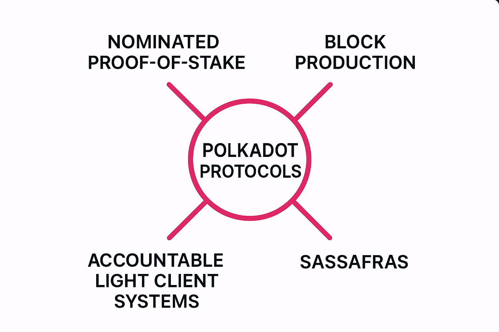

import DocCardList from '@theme/DocCardList';

This section aims to provide a detailed description of the subprotocols that comprise Polkadot. We focus largely on end-to-end mechanics and the properties relevant at this layer; for point-to-point mechanics see `networking`.

<DocCardList />
