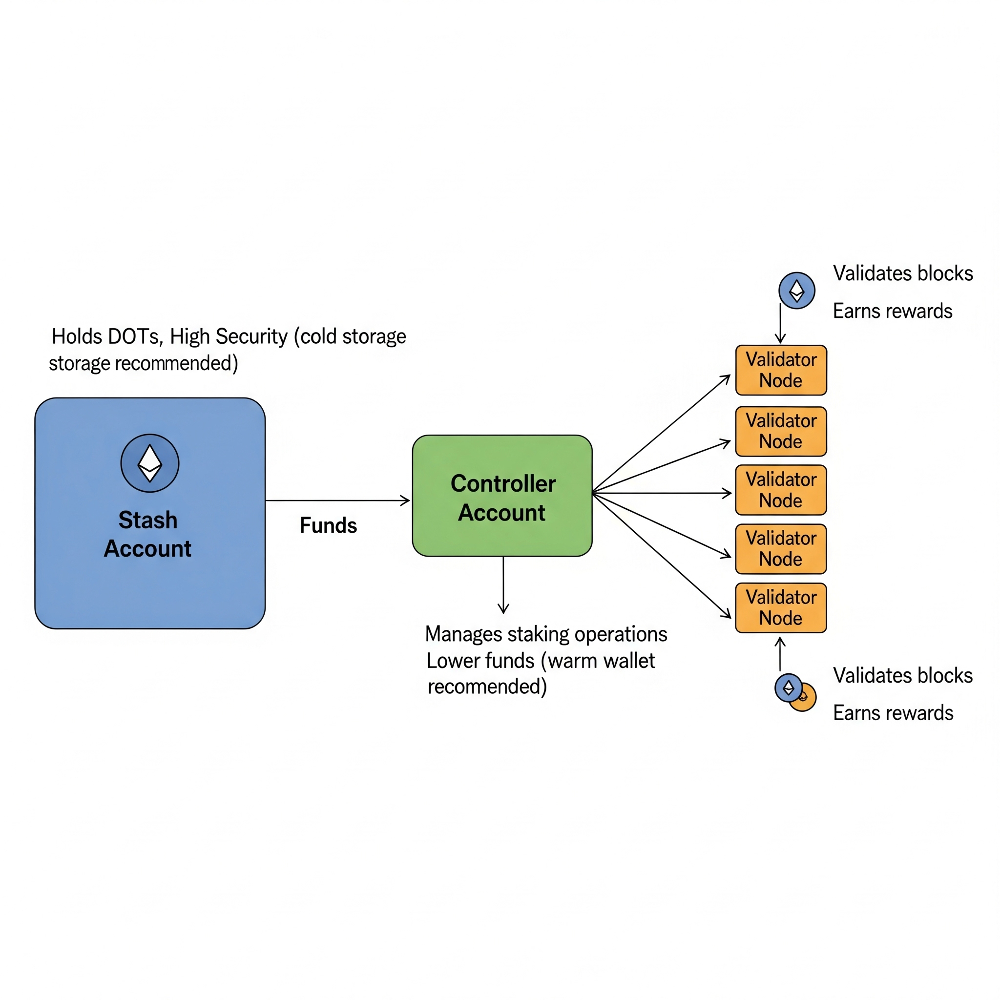

In a sense, all public keys derive their authority from some combination of ceremonies and certificates, with certificate root keys relying entirely on ceremonies for their authority. For example, trust-on-first-use schemes can be viewed as a pair of cerimonies: first, the key is associated with an identity, and second, its fingerprint is compared against others to detect potential threats.

This perspective can be applied to consensus algorithms in proof-of-stake blockchains like Polkadot by viewing the chain itself as a large, ongoing ceremony and treating the staked or bonded account as the root of trust. Certificates issued by these staked account keys that authenticate both the session keys used by Polkadot validators and block producers, as well as the long-term transport layer authentication keys required by protocols like TLS or Noise (see concerns about libp2p's secio).  

## Stash account keys

In Polkadot, these staked or bonded account keys are referred to a "stash account keys" to distinguish them from other key roles discussed below.  The transactions `unbond`, `withdraw_unbonded`, and `bond_extra` are examples described in [^2].  There are several ways to implement these or related operations, but if account size is not overly constrained, a highly flexible approach can be considered: 

Each stash account maintains an unstaked balance $u \ge 0$ and a list of pending unstaking dates and balances $T = { (t,v) }$ with $v>0$, where one entry lacks a specific unstaking date, i.e., $t = \infty$.  An unstaking operation splits $(\infty,v) \in T$ into $(\infty,v - v')$ and $(t,v')$.  Any payment from a staked account completes pending unstaking operations by trasnferring their value into the unstaked balance $u$.  In other words, at block height $h$, a payment of value $v'$ with fees $f$ from a stash account is valid if:

 - $T_1 = \{ (t,v) \in T_0 : t > h \}$,
 - $u_1 := u_0 + \sum \{ (t,v) \in T_0 : t \le h \} - h - f$ remains positive.

Additional metadata in $T$ may be required to ensure that delayed slashing does not affect more recently added stake, although this concern closely resembles the discussion above.  

## Stake controller account keys

Session keys and TLS keys must rotate periodically.  At the same time, stash account keys should remain air-gapped, preventing them from being used for regular signing.  In consequence, an additional layer, called "stake controller account keys", is required. These keys act as intermediaries, managing the nomination or delegation from stash account keys to session keys. 

Because staking involves small, frequent transactions, "stake controller account keys" are actual account keys with their own separate balances, typically much smaller than the "stash account key" they represent. 

In the future, it may be possible to allow certificates issued by stash account keys to restrict the actions of controller keys. This would enhance staker security, especially when certain functions involve reduced slashing risk.  For example, enabling modes for fishermen or block producers could explicitly prohibit nominating or running a validator.  

Currently, however, only one slashing level is supported. As such, all mode transitions are determined by the controller key itself, as described in [^2].

## Certificate location

Certificates can either be stored with account data or provided during protocol interactions. In most cases, the certificate delegating authority from the staked account to the nominator key should be stored within the account data.

Special attention must be given to certificates issued from the controller key to the session key, as the session key requires a proof of possesion.  If these certificates are stored in the controller account, there may be a temptation to trust them without verifying the proof of possesion.  However, the proof-of-possesion chain cannot be inherently trusted, as doing so could allow attackers to escalate privileges by submitting invalid data.  On the other hand, if certificates are provided through interactions, there may be a tendency to verify the proof of possesion repeatedly. This trade-off should be carefully evaluated, either attaching a self-checked flag to the staked account database or by storing session keys in a separate, self-checked account database distinct from the one nodes rely on via the chain.  

## Certificate size

It is possible to save space by using implicit certificates to issue nominator keys. Yet, the initial implementation in [`schnorr-dalek/src/cert.rs`](https://github.com/w3f/schnorr-dalek/blob/master/src/cert.rs#L181) proved insufficient, so a different implicit certificate scheme would be required for this purpose.  

In essence, an account's nominator key could be defined by appending an additional 32 bytes to the account, along with any associated data. Implementing this approach requires a clear understanding of (a) the appropriate structure for the associated data, and (b) whether the space savings justify the added complexity of an implicit certificate scheme, primarily through [reviewing the literature](https://github.com/w3f/schnorr-dalek/issues/4). For now, simplicity is favored by avoiding implicit certificates.

## Implementation

[^1] https://github.com/paritytech/substrate/pull/1782#discussion_r260265815

[^2] https://github.com/paritytech/substrate/blob/1a2ec9eec1fe9b3cc2677bac629fd7e9b0f6cf8e/srml/staking/Staking.md aka https://github.com/paritytech/substrate/commit/1a2ec9eec1fe9b3cc2677bac629fd7e9b0f6cf8e

