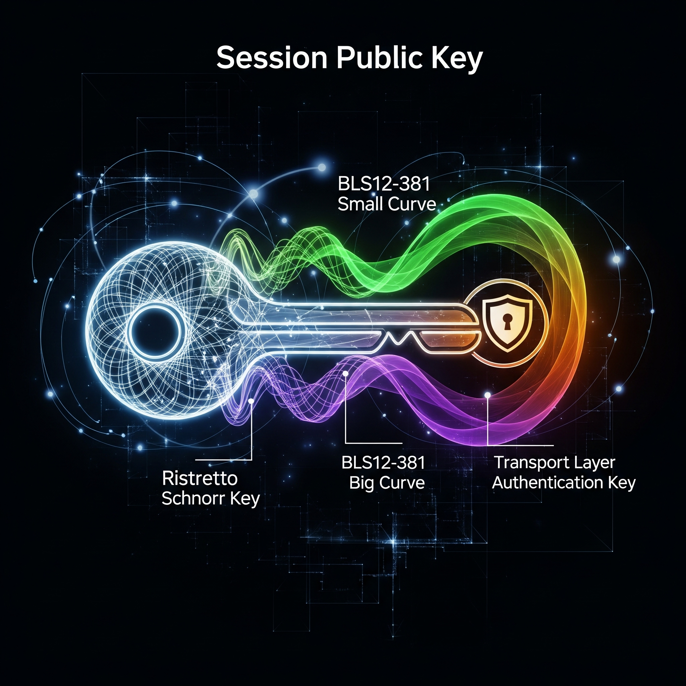

A session public key should consist of three or four types of public keys: 
 
 - Ristretto Schnorr public key (32-byte public keys, 64-byte signatures, 96-byte VRFs)
 
   These are issued from the nominator keys acting as validator operators.  Using an implicit certificate either restricts the setup to a single validator operator or increases code complexity by requiring a designated primary operator.  Implicit certificates also make session key records impossible to authenticate without access to the nominator account, though this may be a desirable property.  
   
   Signers can efficiently batch numerous VRF outputs into a single proof using these keys, similar to CloudFlare's Privacy Pass.  If these VRFs are employed for block production, signers could periodically publish a "sync digest" that consolidates thousands of past block production VRFs into a single verification, significantly improving syncing speed.  Additionally, there is a pathway to to batch-verify these VRFs across multiple signers, which would require enlarging the VRF output and proof size from 96 to 128 bytes.

 - Small curve of BLS12-381 (48-byte public keys, 96-byte signatures)

   Aggregated signatures can be verified more efficiently with this key if the signer set for a particular message is large but irregularly composed, as in GRANDPA. Individual signature generation is slower compared to the the reverse orientation, and the use of non-constant-time extension field arithmetic further increases latency and introduces potential security risks.  Aggregating signatures on the same message also introduces malleability risks.  This scheme may be applicable in certain fishermen protocols.

   [Slothful reduction](https://eprint.iacr.org/2017/437), as discussed in [this GitHub issue](https://github.com/zkcrypto/pairing/issues/98), may eventually be considered for these keys. For now, key splitting offers solid protection against timing attacks, but with even slower signature speed.

 - Big curve of BLS12-381 (96-byte public keys, 48-byte signatures) (optional)
 
   Aggregated signatures, where many messages are verified by the same signer, can be verified considerably faster with this key type. This makes them a potential fit for block production VRFs, as aggregation over the same signer could aid syncing.  Initially, aggregation may be useful for certain VRF non-winner proof designs, but the updated design largerly avoids that dependency. At present, the Ristretto Schnorr VRF appears to be a stronger candidate for block production, offering faster individual verification and highly efficient batching for repeated signers.

   Faster aggregate verification is expected when signer sets are frequently reused, so this scheme may be suitable in contexts where small-curve keys initially seem optimal.  Signature aggregation is expected to be "wild" in GRANDPA, making the small-curve key a better fit in that setting.
 
 - Authentication key for the transport layer.
 
   Including node identity form libp2p is ideal, although secio handles authentication poorly ([see the secio discussion](https://forum.web3.foundation/t/transport-layer-authentication-libp2ps-secio/69)).

A session public key record begins with a prefix consisting of the three keys mentioned above, along with a certificate from the validator operator on the Ristretto Schnorr public key, and a recent block hash and height.  This prefix is followed by a first signature block containing two BLS signatures on the prefix, one from each BLS key. The record is finalized with a second signature block containing a Ristretto Schnorr signature over both the prefix and the first signature block. This structure allows the BLS12-381 keys to be rotated independently of the Ristretto Schnorr public key, possibly enhancing forward security.

The recent block hash is included in the certificate to prevent attacks from inserting rogue keys that could compromise session keys after a fork, assuming the chain is trusted for proofs-of-possession. It is generally advisable not to trust the chain for such proofs, as including a recent block hash only mitigates long-range attacks. 

Currently, there is no aggregation strategy for block production VRFs, so Ristretto Schnorr VRFs may remain the default.  In this case, the longer-lived Ristretto Schnorr session key component can help reduce attacks on the random beacon. 
