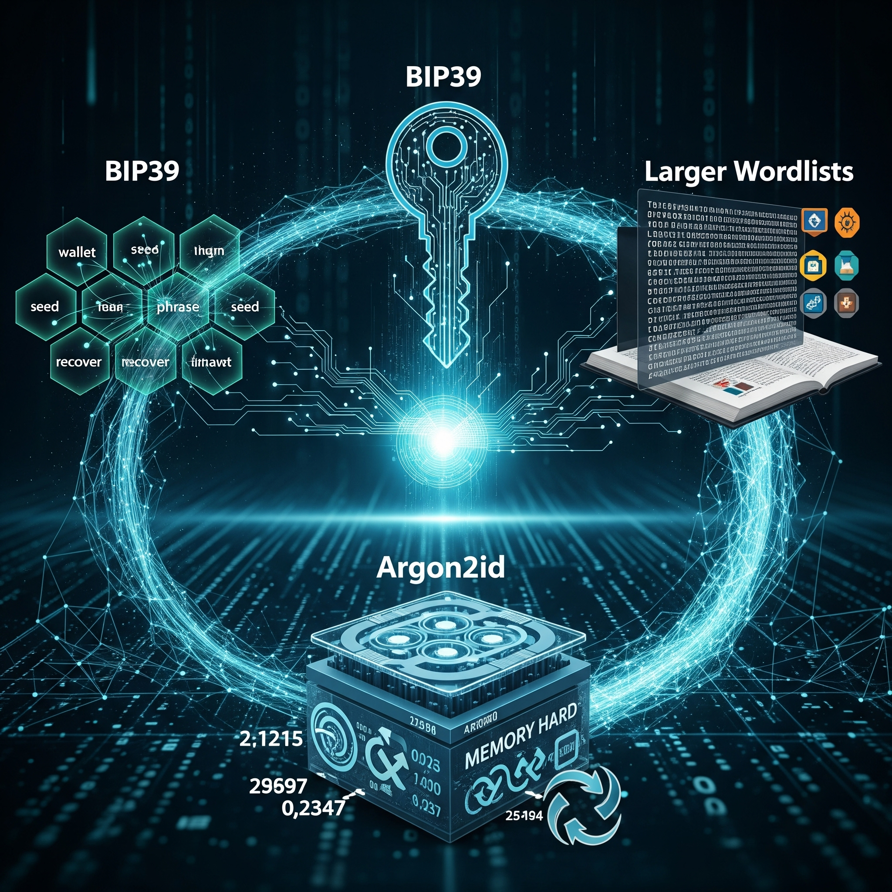

There's a trick for using Ed25519 "mini" private keys in [schnorr-dalek](https://github.com/w3f/schnorr-dalek/blob/master/src/keys.rs), where a user's "mini" private key consists of 32 bytes of unstructured entropy.  

Since [BIP39](https://github.com/bitcoin/bips/blob/master/bip-0039.mediawiki) doesn't present any serious issue, one suggestion is to adopt a similar strategy for deriving secret keys in Polkadot. Alternatively, BIP39 could be modernized in a few small but straightforward ways: 

 - *Argon2id should replace PBKDF2.*  Adam Langely suggests [using time=2 and 64mb of memory](https://github.com/golang/crypto/commit/d9133f5469342136e669e85192a26056b587f503) for interactive scenarios like this. While one might question whether this scenario is truly interactive, it's reasonable to consider constrained devices as a target. The [argone2rs](https://github.com/bryant/argon2rs/issues) crate could also be improved, especially to [ensure the use of at least v1.3, since v1.2.1 was found to be weaker](https://crypto.stackexchange.com/a/40000).
 - *Rejection sampling to support larger wordlists.* One possibility is to apply rejection sampling to the initial entropy stream, avoiding the constraint that the wordlist size must be a power of two, as BIP39 seemingly requires. It's feasible to retain roughly the same level of error correction as BIP32, even when working in a ring of this order.
 - *Actually provide a larger wordlist.* There's been discussion around increasing entropy per word, users might benefit from diceware-style wordlists offering 12.9 bits of entropy per word, compared to BIP32's 11 bits. While some diceware lists may contain confusable words, reviews exist (at least for English). Larger wordlists may not be available for some languges, and shorter lists are easier to curate quickly.

More speculative directions for improvement includes: 

 - *Enhanced error correction.*  BIP39 currently uses only a basic checksum. One idea is to design schemes that correct errors by selecting words via Reed-Solomon. This would involve non-systematic wordlist creation using codewords. Naively, this limits wordlist sizes to finite field sizes (i,e., prime powers), but a workaround could be to run Reed-Solomon separately on each prime power divisor of the wordlist's order.  Alternatives such as [generalizations of Reed-Solomon codes to rings](https://hal.inria.fr/hal-00670004/file/article.pdf) should also be explored, or even using a field of slightly larger order and rejecting choices that fall outside the wordlist.
 - *Support multiple Argon2id configurations.*  If small device constraints become a serious concern, it may be useful to support multiple Argon2id configurations. The idea would be to select among a few predefined configurations using an additional output from the Reed-Solomon code.  The user's desired configuration could then be chosen via rejection sampling. 

