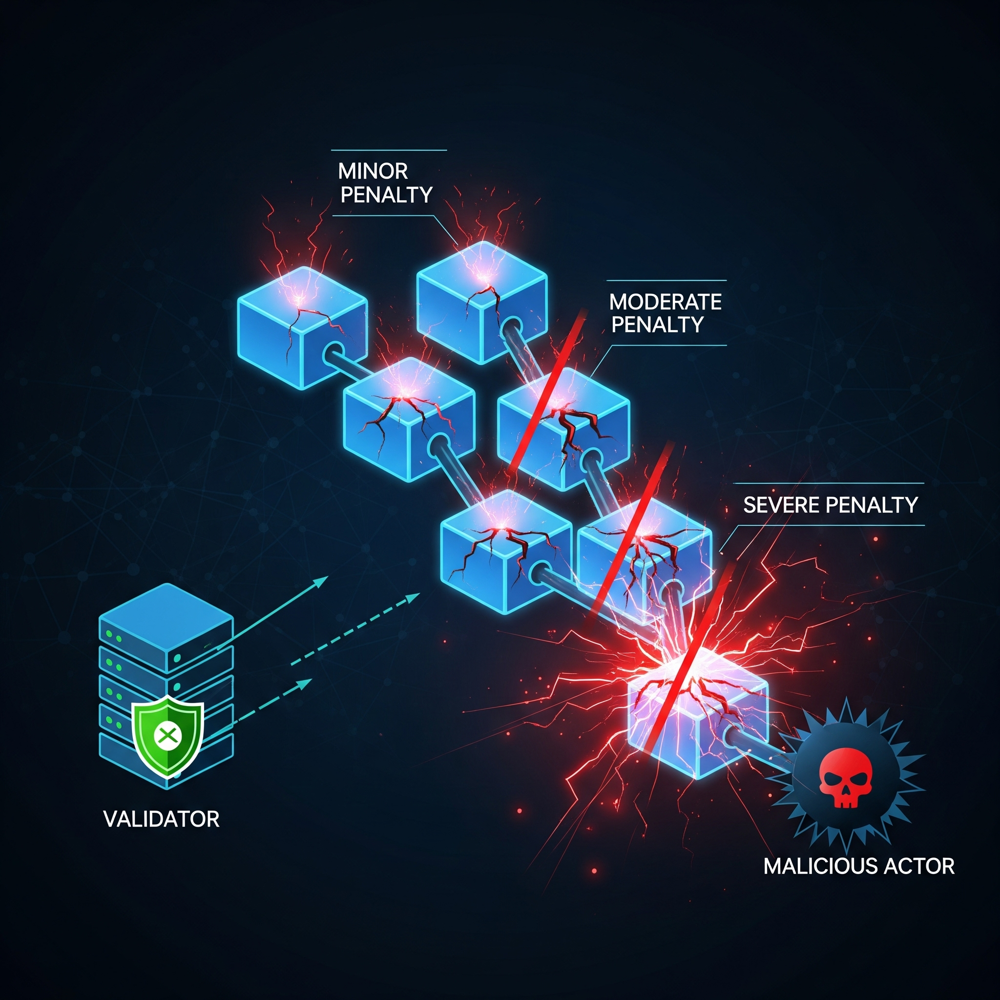

## General principles

**Security threat levels.** The annual interest rate for a validator pool typically ranges between 10% and 20%. Therefore, slashing just 1% of a validator's stake already constitutes a significant penalty, equivalent to several weeks of earnings. 

With this in mind, it is necessary to define security threat levels and corresponding punishments. In addition to assessing the severity of the security risk, it is also important to consider factors such as the likelihood of the misconduct occurring in good faith, the degree of coordination or correlation among validators, and the computational costs imposed on the system.

* Level 1. Misconducts that are likely to eventually occur among most validators, for example isolated cases of unresponsiveness. The penalty involves slashing up to 0.1% of the stake in the validator slot, or applying non-slashing punishments such as removing the validator from the set.

* Level 2. Misconducts that may occur in good faith but reflect poor practices. Examples include concurrent cases of unresponsiveness and isolated instances of equivocation. The goal is to promt culprits to seriously reconsider their behavior, so the slashing amount can be up to 1%.

* Level 3. Misconducts that are unlikely to happen in good faith or by accident, yet do not pose serious security risks or consume singnificant system resources. These cases may indicate i) a concerning level of coordination or correlation among validators, ii) modification of the validator node software, iii) a compromised validator account, or iv) a bug in the software (if confirmed, any slashing is reimbursed). Examples include concurrent cases of equivocation, or isolated instances of unjustified voting in Grandpa. In such casees, validators should lose a substantial amount of both stake and reputation, with punishments designed as a deterrent. The slashing amount can be up to 10%.

* Level 4. Misconducts that: a) pose a serious security risk to the system, b) involve significant collusion among validators, and/or c) require the system to expend considerable resources to address. Punishments at this level should serve as the strongest possible deterrent, with slashing amounts of up to 100%.

**Details on slashing validators and nominators.** When a validator is found guilty of a misconduct, the corresponding validator slot (which includes the validator and their nominators) is slashed by a fixed percentage of their stake, not a fixed amount of DOTs. This means that validator slots with larger stakes will incur greater DOTs losses. The goal is to incentivize nominators to gradually shift their support to less popular validators.

* Note: *Should the validator be slashed more than his nominators? If so, by how much? Care must be taken to avoid bankrupting validators for Level 1 and Level 2 misconducts.*

**Kicking out.** *Context: At the beginning of each era, an NPoS election is held to select validator candidates. Under normal circumstances, current validators are automatically considered candidates for the next election (unless they opt out), and nominators' lists of trusted candidates remain unchanged unless explicitly modified. In contrast, unelected candidates must reconfirm their candidacy in each era to ensure they are online and active.*

When a validator is found guilty of misconduct:

a) They are removed from the list of candidates in the next NPoS validator election (applies to all misconduct levels).

b) They are marked as inactive for the current era (applies to misconducts of levels 2 and above).

c) They are removed from all nominators' lists of trusted candidates (applies to misconducts of levels 3 and above).

Rationale for these actions:

* **Punishment for the validator.** The validator loses the ability to perform payable actions and will not receive rewards while being excluded.

* **System and validator protection.** If a validator node has committed misconduct, there is a high likelihood it may do so again. To err on the side of caution, it's prudent to assume the node remains unreliable until the validator confirms that necessary checks have been completed and they are ready to resume operations. Additionaly, if the validator has been heavily slashed, they may choose to exit the role immediately; no further assumptions should be made about their continued participation.

* **Protection for nominators.** In cases of heavy slashing, nominators should be aware. Their continued support should not be assumed; instead, explicit consent should be obtained before allowing them to back the validator again.

To minimize disruption, validator removal should involve minimal changes to existing schemes. The duration of the current epoch remains unchanged, and this validator continues to be assigned to parachains for the remainder of the epoch. In practice, when someone is "kicked out" simply means the validator is marked as inactive, treated as non-responsive, and their messages are ignored.

If a large number of validators are kicked out, or become unresponsive, the era can be ended early, after the completion of an epoch, to allow for the election of new validators. Alternatively, the system may wait until the end of the era; during this time, Finality may pause, but Babe should continue producing blocks, and Grandpa can catch up at the beginning of the next era.

**Validators database.** This off-chain database tracks both current and past validators and should include: 

* Whether a validator is active or inactive (i.e., kicked out)
* The misconducts each validator has been found guilty of
* Any rewards issued for reporting a misconduct
* The (weighted) nominators supporting each validator, to determine who should be slashed or rewarded
* The number of payable actions performed by each validator in the current era
* Whether a validator is the target of an ongoing challenge (e.g., for unjustified votes in Grandpa)
* And other relevant metadata

 This database must be off-chain and designed to *resist chain reversions*. It should retain visibility into validator history for up to 8 weeks, allowing slashing of validators culprits for misconduct detected after the fact. This retention period aligns with the freeze duration for nominators' and validators' stakes. Additionally, the database must ensure that a validator is not slashed more than once for the same misconduct.

Finally, the database should support an auxiliary protocol: if a validator accumulates more than 1% slashing, regardless of the reason, they should be removed from all the nominators' lists. For example, a validator who is unresponsive in a single era may not be removed, but repeated unresponsiveness over several eras should trigger removals as a safeguard for nominators.

*(Q. How can such a database be efficiently maintained while keeping memory usage low?)*

**Detection mechanisms.** To slash a validator, an objective on-chain "attestation of misconduct" is required, one that is short, *valid on all forks*, and remains valid even in case of *chain reversion*. It must also be ensured that two attestations for the same misconduct cannot both be valid simultaneously, preventing double punishment for a single crime. The previously mentioned database plays a key role in supporting this logic.

Two types of detection mechanisms have been identified:

* **Proof of misconduct.** This is the straighforward case, where a concise proof of misconduct can be submitted on-chain as a transaction. Its validity can be quickly verified by the block producer, making both the generation and verification of the proof efficient. A typical example is equivocation in Grandpa, where the proof consists of two signed votes by the same validator in the same round.

* **Voting certificate.** When no direct proof is available, a collecting voting mechanism is used. Validators vote off-chain, and a certificate of the final decision (containing the signed votes) is issued and submitted on-chain as the attestation of misconduct. Because this procedure is resource-intensive, it is reserved for level 4 misconducts and avoided whenever possible.

**Reporters and their rewards.** In general, rewards are available for actors who execute the protocols necessary to detect misconduct. These rewards are capped at 10% of the total amount slashed, with the remainder allocated to the treasury. If the council ever decides to reimburse a slashing event, most of the DOTS are readily available in the treasury, and only a small portion may need to be minted to cover the reward payout. Depending on the detection mechanism and the security level, three reward scenarios are considered:

* **Levels 1 and 2.** A reward of approximately 10% of the slashed amount is granted to the first party who submits a valid transaction with proof of misconduct. The reward is intentionally modest, just enough to discourage a "no-snitch code of honor" among validators.

* **Levels 3 and 4 (with proof of misconduct).** The same procedure applies, but only *validators* are allowed to submit reports. The reward must be shared among all nominators in the corresponding validator slot to prevent wealth concentration. Multiple culprits and reporters may be involved in a single case (e.g., rejecting a set of Grandpa votes). Regardless, total rewards must not exceed 10% of the total slashed amount, nor exceed 100% of the slashed validators' self-stake. This cap prevents an attack scenario where a validator intentionally fails to benefit at the expense of their nominators. For example, if an entity runs Validator A with 1% of self-stake and Validator B with 100%, it might be tempted to have B report A if the reward exceeds A's self-stake. Additionally, each validator reporter may receive a reward no greater than 20% of their own stake, roughly equivalent to their annual interest rate, ensuring the incentive remains meaningful but not excessive.

* **Level 4 misconducts that require voting.** In this case **fishermen**, staked actors who anonymously monitor the system, play a critical role. At some point, a fisherman may submit a  **report** as a transaction, detailing suspected misconduct, but without providing direct proof. Along with the report the fisherman bonds a portion of their stake, referred to as the "bait". This report initiates an **inspection phase**, during which a subset of the validators is engaged to investigate. Depending on the outcome, this may escalate into a full **voting phase** involving all validators. If the vote confirms the fisherman's report, the fisherman is rewarded with a substantial amount of DOTs. If the report is rejected, the fisherman forfeits their bait. This penalty discourages spam reports, which would otherwise waste system resources. At the same time, the reward must be high enough to justify the risk and the ongoing cost of running system checks. Multiple fishermen may report the same misconduct. In such cases, the seriousness of the threat is gauged by the total amount of bait bonded. The higher the total bait, the more resources are allocated during the inspection phase. Rewards are distributed among all fishermen who submited reports before the voting phase begins. Therefore, if a single fisherman detects misconducts, it is in their interest to quickly rally other fishermen or validators to join the inspection. Fishermen rewards are capped at:
  * no more than 10% of all the total slashed amount 
  * no more than 100% of the slashed validators' self-stake
  * no more 10x the fisherman's own bait. 

## Network Protocol

### Unresponsiveness

Two methods for detecting unresponsiveness.

**Method 1.** Validators submit an "I'm online" heartbeat, a signed message posted on-chain every session. If a validator takes too long to submit this message, they are marked as inactive.

The advantage of this method is that it enables rapid detection of unresponsive validators, allowing the system to act quickly, for example by ending the current era early. A disadvantage is that it only identifies validators who are accidentally offline, not those who are deliberately unresponsive as part of a coodinated attack.

**Method 2.** The system tracks counters for all the payable actions performed by each validator (e.g., blocks produced in Babe, uncle references, validity statements). These counters are used to calculate payouts at the end of each era. In particular, validators are expected to consistently sign validity statements for parachain block. This counter can serve as a measure of responsiveness. Let $c_v$ be the number of validity statements signed by validator $v$ during an era. A validator $v$ is considered unresponsive if:

$$
c_v < \frac{1}{4}\cdot \max_{v'} c_{v'}
$$

where the maximum is taken over all validators in the same era.

**Lemma.** *No validator will be wrongfully considered unresponsive in a billion years.*

*Proof.* (Assume validators are shuffled among parachains frequently enough that, in every era, any two validators have the opportunity to validate a similar number of parachain blocks, even if some parachains produce blocks at a higher rate than others. If this assumption does not hold, the threshold of $1/4$ can be lowered, and the analysis adjusted accordingly.)

Fix an era, and let $n$ be the total number of parachain blocks that a validator can *potentially* validate. Conservatively, take $n\geq 1000$, based on 3 blocks per minute, 60 minutes per hour, 6 hours per era. Consider a responsive validator $v$, and let $p$ be the probability that $v$ successfully issues a validity statement for any given block. Although $p$ depends on many factors, assume $p\geq 1/2$ for a responsive validator. Then the number $c_v$ of validity statements produced by $v$ follows a binomial distribution with expected value $p\cdot n \geq 500$.

This distribution is tightly concentrated around its expectation. The maximum number of validity statements across all validators in the era is at most $n$. Hence, validator $v$ would be wrongfully considered unresponsive only if it produces fewer than $c_v < n/4\leq p\cdot n/2$ validity statements. Applying Chernoff's inequality to bound the tail of the binomial distribution yields:

$$
e^{-\frac{(p\cdot n - c_v)^2}{2p\cdot n}} \leq e^{- \frac{(p\cdot n/2)^2}{2p\cdot n}} = e^{-\frac{p\cdot n}{8}}\leq e^{-\frac{500}{8}}\approx 7\cdot 10^{-28}
$$

This probability is negligible, confirming the claim.
$$
\tag{$\blacksquare$}
$$
 
 

The following slashing mechanism operates without reporters. If, at the end of an era, $k$ out of $n$ validators are unresponsive, then a fraction

$$
0.05\cdot \min\{\frac{3(k-1)}{n}, 1\}
$$

is slashed from each of them. This fraction is zero in isolated cases, less than one-third of a percent for two concurrent cases (assuming $n\geq 50$), and increases to 5% in the critical scenario where approximately one-third of all validators are unresponsive. The intention is to avoid overly harsh penalties for concurrent unresponsiveness, which may occur in good faith. The 5% parameter  can be adjusted as needed. Misconduct is classified as Level 2 if the slashing fraction is at most 1%, and Level 3 otherwise. However, unresponsive validators are not removed immediately during the current era. Removing a validator is equivalent to marking them as unresponsive, which would not improve the situation. Additionally, it is algorithmically simpler to perform these checks at the end of each era.

## Grandpa

### Unjustified vote

Relative to a block $B$ finalized in Grandpa round $r_B$, an unjustified vote is defined as either a prevote or a precommit signed by a validator $v$ in some round $r_v>r_B$, for a chain that does not include $B$. Simply put, it refers to voting for a chain that is incompatible with the current chain of finalized blocks.

According to the Grandpa paper, this behavior can only occur under two conditions: either the validator $v$ is not following the standard protocol (classified as level 3 misconduct), or $v$ has observed a *rejecting set of votes* (defined further below) for block $B$ in a prior round. The detection mechanism thus operates as follows. It begins when another validator $v'$ submits a transaction $T$ containing a reference to block $B$, along with proof that $B$ is finalized and includes the unjustified vote (or a collection or votes, in case of concurrence) relative to $B$. This transaction initiates a public, time-bound challenge. If the challenge goes unanswered within a specified time frame, 10% of the stake from the signer(s) of the unjustified vote(s) is slashed, and validator $v'$ is rewarded with 10% of the slashed amount, on the assumption that honest signers should be capable of responding to the challenge. Alternatively, any validator $v''$ may respond to the challenge by initiating a detection mechanism for a *rejecting set of votes* (defined below). In this case, the current mechanism is finalized without penalizing anyone, and a record is kept of all validators who have raised or answered challenges (i.e. $v'$ and $v''$). These validators will be rewarded once the actual culprits are identified.

As previously mentioned, a 10% slash is applied if a single validator is found guilty of an unjustified vote. Additionaly below you can find details about slashing in cases of concurrent unjustified votes by multiple validators. Any further unjustified votes by the same validator in the same era are ignored, and all subsequent messages from that validator during the remainder of the era are disregarded.

### Rejecting set of votes

*Context: According to the Grandpa paper, a set $S$ of votes has supermajority for a block $B$ if more than $2/3$ of validators in $S$ vote for chains that contain $B$. Similarly, it is impossible for set $S$ to have supermajority for $B$ if more than $2/3$ of validators vote for chains that don't contain $B$. Therefore, a set $S$ can exhibit both properties simultaneously only if more than $1/3$ of validators equivocate within $S$.* 

*If block $B$ is finalized in a round $r_B$, then (assuming honest behavior) there must exist a set $V_B$ of prevotes and a set $C_B$ of precommits in that round, both having supermajority for $B$. A validator $v$ considers block $B$ finalized if it can observe such a set $C_B$ of precommits, even if it has not yet seen a sufficient number of prevotes.*

Relative to a block $B$ finalized in round $r_B$, a rejecting set of votes is defined as a set $S$ of votes of the same type (either prevotes or precommits), cast in the same round $r_S\geq r_B$, for which it is impossible to achieve a supermajority for $B$.

Such a set implies collusion among more than $1/3$ of validators and represents one of the most dangerous attacks on the system, as it can lead to the finalization of blocks on conflicting chains (see Section 4.1 of the Grandpa paper). This is classified as a Level 4 misconduct, and a 100% slash is applied to all culprits.

The detection mechanism is somewhat involved as it begins when a validator $v$ submits a transaction $T$ containing: a) the rejecting set of votes $S$ from round $r_S$, b) a reference to block $B$, along with a set $C_B$ of precommit votes from round $r_B$ demonstrating supermajority for $B$ (proving its finalization), and c) a reference to a previous challenge, if the current transaction is a response to one. 

The next step is to explain how this transaction should be processed, depending on the value of $(r_S-r_B)$ and the type of votes contained in $S$. If $r_S=r_B$ and $S$ is a set of precommits, then $S\cup C_B$ forms a set of precommits that both has supermajority for block $B$ and makes it impossible to have supermajority for $B$. This contradiction implies that more than $1/3$ of validators must have equivocated within $S\cup C_B$, and transaction $T$ contains sufficient information to identify them efficiently. All equivocators will be slashed 100%. If $r_S=r_B$ and $S$ is a set of prevotes, transaction $T$ initiates a time-bound challenge that any validator may respond to. A valid answer consists of a new transaction $T'$ containing: a) a set $V_B$ of prevotes from round $r_B$ with supermajority for $B$, and b) a reference to $T$. 

If a validator $v'$ submits such a response, then the combined set $S\cup V_B$ simultaneously satisfies two contradictory conditions: it has a supermajority for $B$, and it is impossible to have a supermajority for $B$. This implies that more than $1/3$ of validators must have equivocated within the set, and all such validators are slashed 100%. 

If no validator responds to the challenge within the specified time window, all validators who voted in set $C_B$ are slashed 100%. This is because each of them, assuming honest behavior, should be able to respond to the challenge immediately and be rewarded for being the first to do so. 

If $r_s>r_B$, transaction $T$ raises a time-bound challenge that any validator may answer. A valid response consists of a new transaction $T'$ containing: a) the set $C_B$ and a reference to block $B$, b) a set $S'$ of votes of the same type (either prevotes or precommits), cast in the same round $r_{S'}$ for some $r_B\leq r_{S'}<r_S$, for which it is impossible to have a supermajority for $B$, and c) a reference to $T$. If a validator $v'$ submits such a transaction $T'$, then $S'$ constitutes a rejecting set of votes relative to $B$, and the detection mechanism proceeds to a new iteration. Since the value of $(r_s-r_B)$ decreases with each iteration, the process must eventually stop. In contrast, if no validator responds to the challenge within the specified time frame, all validators who voted in set $S$ are slashed 100%, as each of them should be able to respond to the challenge if they are honest (as demonstrated in Lemma 4.2 of the Grandpa paper).

Throughout the iterations, it is sufficient to track the current challenge and maintain the list of validators who have raised or answered previous challenges, as they will be rewarded at the end of the process.

*(Q. What should be done if such a chain of challenges eventually targets a group of validators from a previous era who are no longer active (i.e., not currently validators or online)?)*

### Equivocation / concurrent cases of unjustified vote

An equivocation refers to a validator signing two or more votes in the same round for the same vote type (either prevote or precommit). It admits a short proof of misconduct consisting of two signed votes. A set of votes proving multiple equivocations may be submitted in a single transaction.

A validator may equivocate by mistake in isolated cases. For example, if the nodes are run on multiple computers with imperfect coordination. Such cases are considered Level 2 misconduct. Additional equivocations by the same validator within the same era are ignored.

In each era, a counter $k$ is maintained to track the number of validators who have committed Grandpa equivocations or unjustified votes. A single counter is used for both types of misconducts, as an adversary may combine them to attack the finality mechanism. Multiple concurrent cases of either or both misconducts are treated as a single collusion event. The slashing mechanism described below depends on this counter and applies to isolated and concurrent cases of equivocation, as well as concurrent cases of unjustified vote. In the latter case, this slashing is applied in addition to the penalties described in the corresponding section above.

Suppose a new proof of misconduct is submitted, either for equivocation or unjustified voting, raising the current counter to $k$. Each culprit is then slashed by a proportion of their stake equal to

$$
\min\{(3k/n)^2, 1\}
$$

where $n$ is the total number of validators. This amount starts small, under 0.4% for an isolated case (assuming $n\geq 50$), and increases quadratically to 100% as $k$ approaches the critical threshold of $n/3$. Once the slashed fraction exceeds 1%, the misconduct is classified as Level 3.

Reporter rewards do not scale with $k$. Specifically, reporters receive 10% of what the slashing would have been for $k=1$, multiplied by the number of reported validators. This ensures that reporters have no incentive to withhold information while waiting for the counter to increase. For operational simplicity, culprits are not retro-actively slashed as new cases of concurrence are discovered. This design may also incentivize members of a colluding group to report themselves early, thereby incurring a lower penalty. 

### Invalid vote

*Context: in the current protocol for validating parachain blobs, there is a distinction between **minimally validated** blobs (having, for example, one or two validity statements) and **fully validated** blobs (having a certain minimum number of votes, say five, which increases if there are fishermen reports concerning that blob). Babe block producers may include references to minimimally validated blobs, but Grandpa voters can only vote for relay chain blocks that contain exclusively fully validated blobs (referred to as validated blocks).*

An **invalid vote** is defined as a vote, either prevote or precommit, for a chain that includes a non-validated block, i.e., a block referencing a parachain blob that has not been fully validated. At present, this form of misconduct is not subject to slashing. It does not pose a serious threat, assuming an honest majority among Grandpa voters, and also due to the lack of an efficient detection mechanism.

As a safeguard, the Grandpa protocol should be adjusted so that each voter tracks the validity status of all relay chain blocks (and all parachain blobs). By default, a voter A should ignore any vote from a voter B for a chain that, from A's perspective, contains non-validated blocks. Similarly, a Grandpa voter should disregard any vote that is currently being challenged or has been deemed faulty through a procedure involving unjustified votes or a rejected set of votes (see sections above).

## Babe

### Babe Equivocation

An equivocation in Babe occurs when a block producer generates two or more relay chain blocks within the same time slot. This misconduct admits a concise proof of misconduct consisting of references to both blocks. It may happen in good faith if a validator node is run across multiple machines with poor coordination, and is therefore classified as Level 2. Any additional equivocations by the same validator within the same era are ignored.

Equivocations do not pose a significant threat to Babe unless a long sequence of colluding block producers simultaneously extends two branches of a fork. Such an attack is highly unlikely to succeed as long as the colluding party remains a minority. For this reason, the proposal is to disregard concurrent equivocations within the same era. Alternatively, a counter $k$ could be maintained to track the number of block producers who have equivocated in the current era. New culprits would be slashed by a fraction of their stake equal to:

$$
\min\{(3k/n)^2, 1\}
$$

where $n$ is the total number of validators. Once this fraction exceeds 1%, the misconduct is classified as level 3. Slashings are not retroactively adjusted as new cases are discovered, and reporter rewards do not scale with $k$. Specifically, reporters receive 10% of what the slashing would have been for $k=1$.

### Invalid Block

An invalid block can occur, for instance, when a block producer includes a reference to a parachain blob that lacks any validity statements. Invalid blocks do not pose a threat to Babe unless a large fraction of block producers choose to build on top of such a block. However, this type of attack is unlikely to succeed. For this reason, this misconduct is not currently subject to slashing.

If a slashing mechanism is eventually required, one option would be for all validators to vote on the validity of the block. Alternatively, a block producer could include the entire invalid block in a new block as proof of misconduct.

## Parachain validity-availability protocol

### Invalid validity statement

This misconduct is defined as a parachain validator issuing a validity statement for an invalid blob. It poses the highest security risk, especially in case of concurrence, and unfortunately does not admit a direct proof of misconduct. As a result, the only viable response is through a voting mechanism. This is classified as Level 4 misconduct and subject to a 100% slash.

The detection mechanism is as follows. Inspection phase: In the current standard protocol, Babe block producers include references to *minimally validated* blobs (i.e, blobs with one validity statement). Once a blob is added to a relay chain block, the protocol will randomly select additional validators to inspect the blob and issue further validity statements. this process continues until the blob becomes *fully validated*. 

If one or more fishermen submit reports referencing to a specific blob, the protocol automatically adjusts by raising the threshold for full validation and selecting more validators to inspect that blob. These validators are compensated for issuing additional validity statements, as these are considered payable actions. However, only validators selected by the protocol are authorized to issue them. In contrast, fishermen continously monitor the validity of blobs independently.

Voting phase: the voting phase begins as soon as there is at least one statement of validity and one statement of invalidity issued by validators for the same blob. This can occur either before or after the blob is referenced in a Babe block. If it occurs beforehand, the inspection phase is skipped. In any case, fishermen reports are ignored once a statment of invalidity has been issued.

When a validator sees both a statement of validity and a statement of invalidity for a blob, they inspect the blob and issue their own statement. Eventually, most relay chain validators will participate in the vote, and they are compensated for doing so, as these are considered payable actions. By counting the number of validity statements and the number of invalidity statements, as soon as one of these counts exceeds $n/3$ (where $n$ is the number of validators), and the other does not, the plurality vote becomes official. 

* If the blob is deemed invalid, all validators who stated otherwise are slashed, and rewards for fishermen become available 

* If the blob is deemed valid, both the fishermen and the validators who stated otherwise are slashed.

If both the number of validity statements and the number of invalidity statements exceed $n/3$, there is unfortunately no way to determine who the culprits are. In such a case, which by the way should never occur,  no one is slashed, any prior slashing is reimbursed, and the blob is considered invalid to err on the side of caution.

**For further questions and inquiries please contact**: [Alfonso Cevallos](/team_members/alfonso.md)
