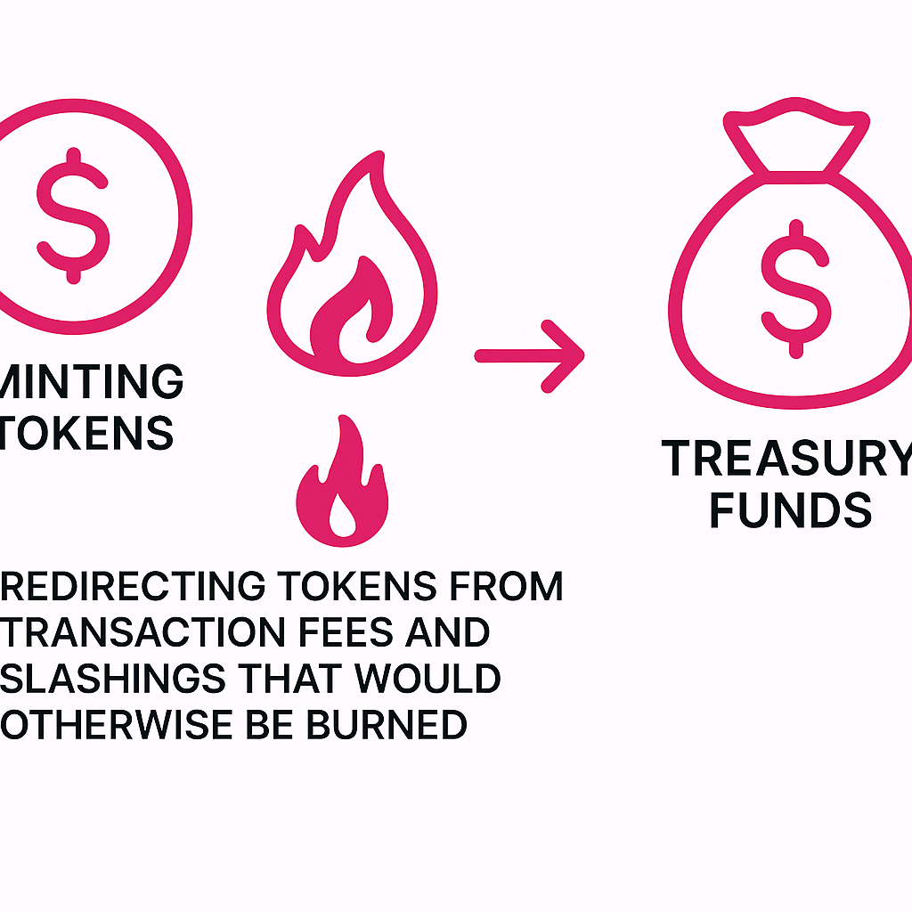

The treasury refers to the system's continuous need to raise funds. These funds are used to compensate developers for delivering software updates, implementing changes approved through referenda, adjusting parameters, and maintaining overall system stability.

Treasury funds can be raised through two mechanisms:

1. Minting new tokens, which contributes to inflation; and

2. Redirecting tokens from transaction fees and slashings that would otherwise be burned.

These mechanisms mirror traditional methods used by governments to raise funds: minting coins, which leads to controlled inflation, and collecting taxes and fines.

While raising funds solely by minting new tokens is possible, it is more sensible to redirect tokens from transaction fees and slashings, otherwise destined to be burned, into the treasury.

- By redirecting tokens in this manner, the amount of actual stake burning is reduced, resulting in better control over the inflation rate. It is worth noting that stake burning leads to deflation, and the events that trigger it are unpredictable.

- Following an event that results in significant stake slashing, governance may opt to partially reimburse the affected stake. In the event of a code bug or other extenuating circumstances, having DOTs readily available in the treasury is advantageous, as it eliminates the need to burn and later mint new tokens.

- Periods marked by unusually high levels of stake burning—whether caused by misconduct or excessive transaction fees—indicate systemic issues that require resolution. To cover the development costs associated with fixing such problems, additional treasury funds are needed during these times.

**For any inquiries or questions, please contact** [Jonas Gehrlein](/team_members/Jonas.md)
