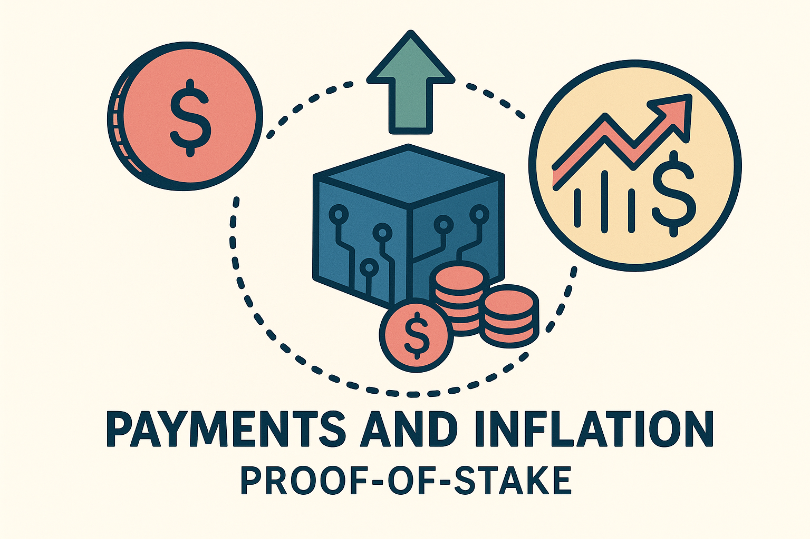

Payments to validators and nominators for their participation in block production (BABE) and finality (GRANDPA), as well as on payments arising from routine token minting, are among the core pillars of the Polkadot NPoS system. While other forms of compensation, including slashing penalties, rewards to misconduct reporters and fishermen, or distributions from transaction fees, are also of main relevance, they are discussed in separate sections.

Since these payments are the primary driver of inflation in the system, the first step is to outline the inflation model. Two sets of adjustable parameters are considered: one for the eventual scenario in which parachains are fully launched, and another for the interim period, during which liquidity is not constrained by parachain bonds.

### Inflation model

Let $x$ be the *staking rate* in NPoS at a particular point in time, that is, the total amount of tokens staked by nominators and validators divided by the total token supply. The value of $x$ always lies between 0 and 1.

__Adjustable parameter:__ $\chi_{ideal}$ represents the desired long-term staking rate. A drop below this rate compromises security, making it necessary to give strong incentives for DOT holders to increase their stakes. Conversely, a rise above this threshold reduces liquidity, which is also undesirable, making it neccesary to sharply reduce incentives.

Let $i=i(x)$ denote the yearly *interest rate* in NPoS. In other words, $i=i(x)$ represents the total annual amount of tokens minted to compensate all validators and nominators for block production (BABE) and finality (GRANDPA), divided by the total amount of tokens staked by them. Intuitively, $i(x)$ represents the incentive offered to participants for staking. Hence, $i(x)$ should be a monotonically decreasing function of $x$, since less incentive is required as the staking rate increases.

* For ease of comprehension, the focus is placed on the annual interest rate rather than the rate per block or per epoch. Accordingly, $i(x)$ represents the total payout perceived by someone who continuously stakes one DOT over the course of a year. The interest rate per block can be easily derived from this annual rate.
* The function $i(x)$ serves only as an indicator of the average interest rate, as not every staked participant is compensated strictly in proportion to their stake. For instance, a validator may receive higher rewards than a nominator with an equal stake, and a validator who produces a block may temporarily earn more than one who does not.

__Adjustable parameter:__ Let $i_{ideal}:=i(\chi_{ideal})$ denote the interest rate paid in the ideal scenario where $x=\chi_{ideal}$. This rate is indirectly determined by the system's overall inflation.

Let $I$ be the yearly *inflation rate*; i.e.

$$
I=\frac{\text{token supply at end of year} - \text{token supply at beginning of year}}{\text{token supply at beginning of year}}
$$

The inflation rate is given by

$$
I=I_{NPoS}+I_{treasury}-I_{slashing} - I_{tx-fees}
$$

where:
* $I_{NPoS}$ represents the inflation resulting token minting to reward nominators and validators.
* $I_{treasury}$ accounts for the inflation due to minting for treasury funding.
* $I_{slashing}$ reflects the deflation caused by token burning following validator or nominator misconduct.
* $I_{tx-fees}$ corresponds to the deflation resulting from the burning of transaction fees.[^1]

$I_{NPoS}$ should be by far the largest of these components, making it the main driver of overall inflation. By redirecting all tokens originally destined for burning, whether from slashing or transaction fees, into the treasury, we effectively reduce the magnitude of the deflationary terms in the formula (see the section on treasury). If $I_{NPoS}$ is a function of the staking rate $x$, the relationship between $I_{NPoS}(x)$ and $i(x)$ is clearly given by

$$
I_{NPoS}(x)=x\cdot i(x)
$$

From our previous analysis, we observe that $I_{NPoS}(\chi_{ideal})=\chi_{ideal}\cdot i_{ideal}$. Since the goal is to steer the market toward a staking rate of $x=\chi_{ideal}$, it is reasonable for the inflation rate $I_{NPoS}(x)$ to reach its **maximum at this target value**.

__Adjustable parameter:__ Let $I_0$ denote the limit of $I_{NPoS}(x)$ as $x$ approaches zero, that is, when neither validators nor nominators are staking any DOTs. This value shoud be close to zero but not exactly zero, since it is important to ensure that validators' operational costs are always covered, even if nominators receive no compensation. Accordingly, $I_0$ represents an estimate of the total operational costs of all validators, expressed as a fraction of the total token supply. $I_{NPoS}(x)$ should remain strictly greater than $I_0$ for all values of $x$, including in the limit as $x$ approaches 1.

For simplicity, the inflation function increases linearly between $x=0$ and $x=\chi_{ideal}$, and decreases exponentially between $x=\chi_{ideal}$ and $x=1$. The exponential decay for $I_{NPoS}(x)$ induces a corresponding exponential decline in $i(x)$, allowing the interest rate to drop sharply beyond $\chi_{ideal}$ to help prevent illiquidity. At the same time, this formulation enables controlled changes in the rate, expressed by the ratio $i(x+\varepsilon)/i(x)$, where $\varepsilon$ is a small increment in $x$. Bounding the rate of change is important for ensuring predictability and stability for nominators and validators.

__Adjustable parameter:__ The *decay rate* $d$ is defined so that the inflation rate decreases by no more than 50% when $x$ increases by $d$ units beyond $\chi_{ideal}$; that is, $I_{NPoS}(\chi_{ideal} + d) \geq I_{NPoS}/2$. We also suggest setting $d=0.05$.

Based on the previous discussion, we propose the following interest rate and inflation rate functions, which depend on the parameters $\chi_{ideal}$, $i_{ideal}$, $I_0$, and $d$. Let

$$
\begin{align}
I_{NPoS}(x) &= \begin{cases}
I_0 + \Big(I_{NPoS}(\chi_{ideal}) - I_0\Big)\frac{x}{\chi_{ideal}}
&\text{for } 0<x\leq \chi_{ideal}\\
I_0 + (I_{NPoS}(\chi_{ideal}) - I_0)\cdot 2^{(\chi_{ideal}-x)/d}
&\text{for } \chi_{ideal} < x \leq 1
\end{cases}, \text{ and}\\
\\
i(x)&= I_{NPoS}(x)/x.
\end{align}
$$

It can be verified that:
* $I_{NPoS}\geq I_0$ for all $0\leq x \leq 1$, with equality at $x=0$,
* $i(\chi_{ideal})=i_{ideal}$, 
* $I_{NPoS}(x)$ reaches its maximum at $x=\chi_{ideal}$, where it equals $\chi_{ideal}\cdot i_{ideal}$,
* $i(x)$ is a monotonically decreasing function.

### Ideal staking rate
Currently, the ideal staking rate is a function of the number of active parachains, excluding system parachains. Specifically, it decreases from 75% by 0.5% per active parachain, or also refered to as $cores$, down to a minimum of 45%. The following formula defines the ideal staking rate:

$$
\begin{align}
\chi_{ideal} = 0.75 - min(cores, 60) / 200
\end{align}
$$

### Example: Inflation model
Assuming the number of active parachains leads to $\chi_{ideal}=0.5$, this implies $i_{ideal}=0.2$. Additionaly, $I_{0}$ is set to 0.025 and $d$ to 0.05. Under this configuration, the resulting plots show $i(x)$ in green and $I_{NPoS}(x)$ in blue.

Note that the curves shift depending on the value of $\chi_{ideal}$. Alternative parameter configurations are available [here](https://www.desmos.com/calculator/2om7wkewhr).

### Payment details

Honest validators participate in several protocols, and we either reward their successful involvement or penalize their absence—depending on which is easier to detect. From this perspective, we choose to reward validators (and their nominators) specifically for *validity checking* and *block production*, as these activities are the most reliably observable.

In the validity checking branch, we reward:

* A parachain validator for each validity statement it issues for a parachain block.

In the block production branch, we reward:

* A block producer for producing a non-uncle block on the relay chain,
* A block producer for referencing a previously unreferenced uncle block,
* The original producer of each referenced uncle block.

These are thus considered payable actions. We define a point system in which a validator earns a fixed number of points for each payable action executed. At the end of each era, validators are compensated in proportion to the total points they have earned.[^2] 

__Adjustable parameters:__ We propose the following point system:

* 20 points for each validity statement issued,
* 20 points for each (non-uncle) block produced,
* 2 points awarded to the block producer for referencing a previously unreferenced uncle,
* 1 point awarded to the original producer of each referenced uncle.[^3] 

In each era $e$, and for each validator $v$, we maintain a counter $c_v^e$ that tracks the number of points earned by $v$. Let $c^e =
\sum_{\text{validators } v} c_v^e$ be the total number of points earned by all validators in era $e$, and let $P^e_{NPoS}$ denote the target total payout to all validators and their nominators for that era (see the previous section on the inflation model for details on how $P^e_{NPoS}$ is determined). Then, at the end of era $e$, the payout to validator $v$ and their nominators is given by

$$
\frac{c_v^e}{c^e} \cdot P^e_{NPoS}
$$

The counters can also be used to discourage unresponsiveness: if a validator earns close to zero points from payable actions during an era, or any other defined time period, they may be removed from the active set. See the note on Slashings for further details.

### Distribution of payment within a validator slot

In any given era, the stake of a nominator $n$ is typically distributed accross multiple validators, for example, 70% to validator 1, 20% to validator 2, and 10% to validator 3. This distribution is determined automatically by the NPoS validator election mechanism, which runs at the beginning of each era (see the notes on NPoS for further details).

If there are $m$ validators, the stake distribution partitions the global stake pool into $m$ slots-one per validator. The stake in each validator slot consists of 100% of that validator's stake, along with a fraction (possibly zero) of the stake from each nominator who supported that validator. A validator's stake is sometimes referred to as "self-stake" to distinguish it from the *validator slot's stake*, which is typically much larger. 

In the previous subsection we described how payouts are assigned to each validator slot during a given era. In this subsection, we explain how the slot's payout is further distributed among the validator and their nominators. Ultimately, a nominator's payout for a given era equals the sum of their payouts from each slot in which they have a stake.

Since neither nominators nor validators can individually control the stake partitioning into validator slots, which is determined automatically by the validator election mechanism, nor the exact payouts, which depend on global parameters such as the staking rate, participants cannot know in advance the exact reward they will receive during an era. In the future, nominators may be able to specify their desired interest rates. This feature is currently disabled to simplify the optimization problem the validator election mechanism solves.

The mechanism utilizes as much of a nominator's available stake as possible. That is, if at least one of their approved validators is elected, their entire available stake will be used. The rationale is that greater stake contributes to stronger security. 

In contrast, validator slots are compensated equally for equal work, and NOT in proportion to their stake levels. If a validator slot A has less stake than validator slot B, the participants in slot A receive higher rewards per staked DOT. This design encourages nominators to adjust their preferences in subsequent eras to support less popular validators, thereby promoting a more balanced stake distribution across validator slots, one of the core objectives of the validator election mechanism (see notes on NPoS for more details). This also increases the likelihood that new validator candidates can be elected, supporting decentralization within systems.

Within a validator slot, payments are handled as follows: First, validator $v$ receives a "commission fee", an amount entirely set by $v$ and publicly announced prior to the era, before nominators submit their votes. This fee is intended to cover $v$'s operational costs. The remaining payout is then distributed among all participants in the slot, including $v$ and nominators, in proportion to their stake. In other words, validator $v$ is considered as two entities for the purpose of payment: a non-staked entity that receives a fixed commission, and a staked entity treated like any other nominator and rewarded pro rata based on stake. A higher commission fee increases $v$'s total payout while reducing returns for nominators; however, since the fee is announced in advance, nominators tend to support validators with lower fees (assuming other factors are equal). 

We thus allow the market to regulate itself. A validator candidate who sets a high commission fee risks failling to attract sufficient votes for election, while validators with strong reputations for reliability and performance may justify charging higher fees, an outcome that is considered fair. For nominators, backing less popular or riskier validators may result in higher relative rewards, which aligns with expected risk-reward dynamics.

--
Additional notes

Finality gadget [GRANDPA](https://github.com/w3f/consensus/blob/master/pdf/grandpa.pdf)

Block production protocol [BABE](Polkadot/protocols/block-production/Babe.md)

The [NPoS scheme](Polkadot/protocols/NPoS/index.md) for selecting validators

**For any inquiries or questions, please contact** [Jonas Gehrlein](/team_members/Jonas.md)

[^1]: The rewards perceived by block producers from transaction fees (and tips) do not come from minting, but from tx senders. Similarly, the rewards perceived by reporters and fishermen for detecting a misconduct do not come from minting but from the slashed party. This is why these terms do not appear in the formula above.

[^2]: The exact DOT value of each point is not known in advance, as it depends on the total number of points earned by all validators during that era. This design ensures that the total payout per era aligns with the inflation model defined above, rather than being directly tied to the number of payable actions executed.

[^3]: Note that what matters here is not the absolute number of points, but rather the point ratios, which determine the relative rewards for each payable action. These point values are parameters subject to adjustment by governance.