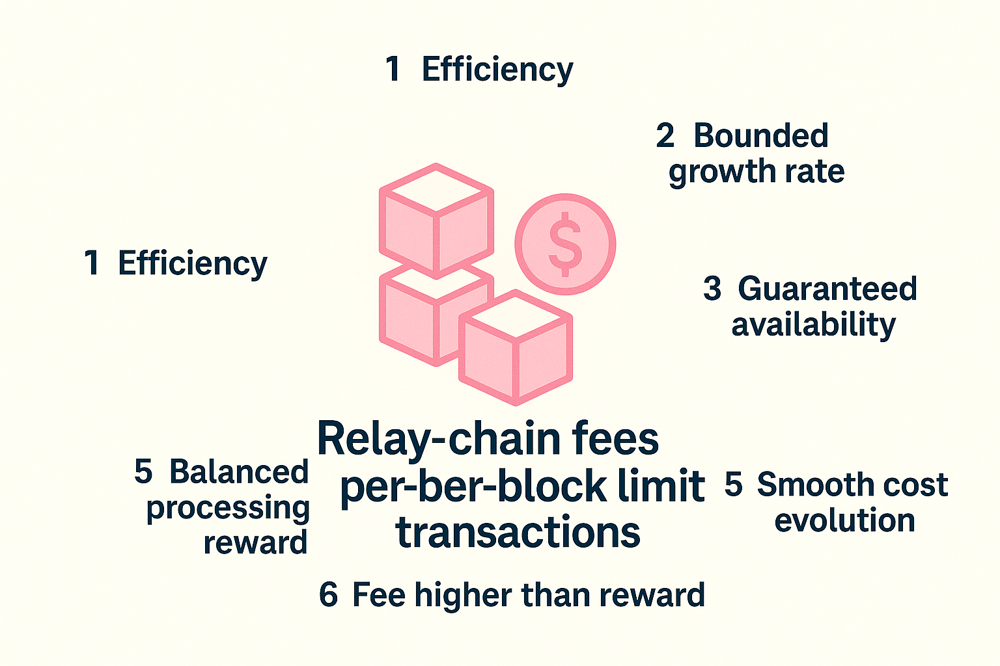

## Relay-chain transaction fees and per-block transaction limits

With a clearer understanding of how payments and inflation occur, we can now discuss the desired properties of relay-chain transactions.

1. Each relay-chain block should be processed efficiently, even on less powerful nodes, to prevent delays in block production.
2. The growth rate of the relay-chain state is bounded. 2′. Ideally, the absolute size of the relay-chain state is also bounded.
3. Each block *guarantees availability* for a fixed amount of operational, high-priority transactions, such as misconduct reports.
4. Blocks are typically underfilled, which helps handle sudden spikes in activity and minimize long inclusion times.
5. Fees evolve gradually enough that the cost of a particular transaction can be predicted accurately within a few minutes.
6. For any transaction, its fee must be strictly higher than the reward perceived by the block producer for processing it. Otherwise, the block producer may be incentivized to fill blocks with fake transactions.
7. For any transaction, the processing reward perceived by the block producer should be high enough to incentivize its inclusion, yet low enough to discourage the creation of a fork to capture transactions from a previous block. In practice, this means the marginal reward for including an additional transaction must exceed its marginal processing cost, while the total reward for producing a full block remains only slightly greater than that for an empty block, even when tips are taken into account.

For now, we’re focusing on satisfying properties 1 through 6 (excluding 2′), and plan to revisit properties 2′ and 7 in a future update. Further analysis of property 2 is also among our next steps.

The number of transactions processed in a relay-chain block can be regulated in two ways: by imposing resource limits and by adjusting transaction fees. Properties 1 through 3 are satisfied through strict resource limits, while properties 4 through 6 are addressed via fee adjustments. The following subsections present these two techniques in detail.

### Limits on resource usage

When processing a transaction, four types of resources may be consumed: length, time, memory, and state. Length refers to the size of the transaction data in bytes within the relay-chain block. Time represents the duration required to import the transaction, including both I/O operations and CPU usage. Memory indicates the amount of memory utilized during transaction execution, while state refers to the increase in on-chain storage due to the transaction.

Since state storage imposes a permanent cost on the network, unlike the other three resources consumed only once, it makes sense to apply rent or other Runtime mechanisms to better align fees with the true cost of a transaction and help keep the state size bounded. An alternative approach is to regulate state growth via fees rather than enforcing a hard limit. Still,  implementing a strict cap remains a sensible safeguard against edge cases where the state might expand uncontrollably.

**Adjustable parameters.** For now, we propose the following limits on resource usage when processing a block. These parameters may be refined through governance based on real-world data or more advanced mechanisms."

* Length: 5MB
* Time: 2 seconds
* Memory: 10 GB
* State: 1 MB increase

A transaction consumes varying amounts of the last three resources depending on its length, type, input arguments, and the current state. For simplicity, we consider the worst-case state for each transaction type and evaluate only the byte length of its input arguments. This allows transactions to be classified by length, type, and argument size, enabling tests (based on worst-case state assumptions) to assess their typical resource usage.

In this model, transactions within a block are processed sequentially. To maintain the overall memory bound, it is sufficient that each transaction respects its individual memory limit. This constraint is currently met, though parallel processing may be considered in future developments.

To further simplify our model, we define transaction *weight* as a parameter that reflects both time usage and state growth. Specifically, a transaction’s weight is defined as the *max* of its typical time and state usage, each expressed as a fraction of the corresponding block limit. Given a collection of transactions, we sum their lengths and their weights separately, and include them in the same block only if both constraints are satisfied. This constitutes a strict resource usage limit that must be upheld for every block.

There is an additional constraint on resource usage—a distinction between 'normal' and 'operational' transactions. The latter category includes high-priority transactions, such as fisherman reports. A group of normal transactions is permitted within a block only if the combined total of their lengths and weights remains below 75% of the respective limits. This ensures that each block reserves at least 25% of resources for operational transactions.

**Details on establishing typical resource usage for transactions.** Length is easy to determine through inspection. To evaluate time and memory usage, we prepare the chain with a worst-case state, a state in which importing the given transaction type demands the highest time and memory. For each transaction type, we generate 10,000 transactions with inputs selected to maximize import time under that state, then measure the mean and standard deviation of resource usage in the Wasm environment. If the standard deviation exceeds 10% of the mean, we expand the sample size beyond 10,000. Finally, the state increase is estimated by inspecting worst-case scenarios across a large transaction sample.

### Setting transaction fees

The model described above sets the fee for a transaction based on three parameters: transaction type, length, and weight (as defined in the previous subsection). This fee differentiation reflects the varying resource costs associated with each transaction and is designed to incentivize or discourage specific market behaviors.

A portion of the transaction fee is allocated to the block producer to incentivize inclusion, though not the entire amount. This helps to discourage the inclusion of bogus transactions. The initial proposal assigns 20% of each transaction fee to the block producer, with the remaining 80% directed to the treasury. While burning a portion can help reduce inflation, it is preferable to avoid this in order to maintain better control over the inflation rate. This percentage may be adjusted in the future and could vary depending on the transaction type. In this way, block producers are incentivized to include certain transaction types without needing to adjust the base fee.

A transaction fee (tx) is computed as follows:

$$
fee(tx) = base\_fee + type(tx) \cdot length(tx) + c_{traffic} \cdot weight(tx)
$$

Here, $c_{traffic}$ is a transcation-independent parameter that evolves over time according to network traffic. You can find an explanation of this parameter in the following subsection. The parameter $type(tx)$ depends solely on the transaction type; currently, we set $type(tx)$ to zero for operational transactions.

The term $weight(tx)$ represents the processing cost incurred by the block producer, while the term $type(tx) \cdot length(tx)$ captures the opportunity cost of including one transaction over another within a block.

### Adjustment of fees over time

Transaction demand on blockchains is typically irregular. There may be short-term spikes in activity—ranging from hours within a day to days within a month—as well as longer-term trends. To account for these fluctuations, we require a mechanism that automatically adjusts transaction fees over time. According to the law of supply and demand, increasing fees should reduce demand, while decreasing fees should encourage it.

To manage activity peaks, a trade-off must be made between rapidly raising transaction fees and risking long transaction inclusion times. Two mechanisms help mitigate these effects. The first adjusts fees dynamically in response to short-term fluctuations. The second mechanism adjusts gradually, in line with long-term trends, and incorporates tipping to give users control over waiting times during peak hours. While the slower, tip-enabled approach appears to offer a more balanced solution, both mechanisms warrant close consideration.

#### 1. Fast adjusting mechanism

Transaction fees are fixed for all users within each block (tipping is not supported), although fee levels fluctuate significantly over time. Recall that there is a hard limit on the total length and weight of all transactions in a block, along with a secondary hard limit for 'normal' transactions (i.e., non-operational), equal to 75% of the primary block limit.

**Definition.** A block's saturation level with respect to normal transactions is a fraction $s$ ranging from 0 and 1, that indicates how close the block is to reaching its limit for normal transactions. The saturation level of a block $B$ is defined as:

$$
s(B):=\max\{\frac{\sum_{\text{normal } tx \in B} length(tx)}{\text{normal length limit}}, \frac{\sum_{\text{normal } tx \in B} weight(tx)}{\text{normal weight limit}}\}
$$

Here, the normal length limit, that is, the block length limit for normal transactions, is set at 75% of the overall length limit. Likewise, the normal weight limit is 75% of the overall weight limit.

**Adjustable parameter** Let $s^*$ denote the target block saturation level, the intended long-term average for saturation with respect to normal transactions. We initially propose $s^*=0.25$, meaning blocks are 25% full on average, allowing the system to handle sudden spikes of up to four times the typical volume of normal transactions. This parameter may be adjusted in response to observed spike behavior relative to average volume. It typically reflects a trade-off between higher average fees and longer transaction inclusion times during periods of elevated activity.

As previously mentioned, a transaction fee is computed as $fee(tx) = base\_fee + type(tx) \cdot length(tx) + c_{traffic} \cdot weight(tx)$, where $c_{traffic}$ is an transaction-independent parameter. Let $s$ denote the saturation level of the current block. If $s>s^*$ we slightly increase $c_{traffic}$, and if $s<s^*$ we slightly decrease it.

**Adjustable parameter:** Let $v$ be a fee variability factor that controls how rapidly the transaction fees adjust. The parameter $c_{traffic}$ is updated from one block to the next as follows:

$$
c_{traffic} \leftarrow c_{traffic}\cdot (1+ v(s-s^*) + v^2(s-s^*)^2/2)
$$

This forms a feedback loop with multiplicative weight updates. It closely approximates the more sophisticated update $c_{traffic} \leftarrow c_{traffic}\cdot e^{v(s-s^*)}$, with the following properties:

* Assuming $v$ is small, the relative change in $c_{traffic}$ is proportional to the difference $(s-s^*)$, that is

$$
\frac{c_{traffic}^{new} - c_{traffic}^{old}}{c_{traffic}^{old}}\approx v(s-s^*)
$$

* If $k$ blocks are produced during a given time period and the average saturation level is $s_{average}$, then the relative change in $c_{traffic}$ over that period becomes proportional to $k$ times the difference $(s_{average} - s^*)$, i.e.

$$
\frac{c_{traffic}^{final} - c_{traffic}^{initial}}{c_{traffic}^{initial}}\approx vk(s_{average}-s^*)
$$

Suppose we decide that the transaction fees should not vary by more than a fraction $p$ over a period of $k$ blocks, even in the case of 100% saturation throughout that period. Under this constraint, we obtain the following formula:

$$
\text{fees relative change} \leq \frac{c_{traffic}^{final} - c_{traffic}^{initial}}{c_{traffic}^{initial}}\approx vk(s_{average}-s^*) \leq vk(1-s^*)\leq p
$$

which gives us the variability factor $v\leq \frac{p}{k(1-s^*)}$.

Suppose that, during peak periods, some transactions must wait up to $k=20$ blocks to be included. An increase in fees exceeding 5% $(p=0.05)$ during that interval would be considered unfair to users. Given $s^*=0.25$, the formula above yields $v\leq 0.05/[20(1-0.25)]\approx 0.0033$.

#### 2. Slow adjusting mechanism

Under this mechanism, fees remain nearly constant over short periods, adjusting only in response to long-term trends. During spikes, inclusion times may lengthen, allowing users to add tips, thereby creating a market for preferential inclusion.

Using the same formula as above, we update the transaction fees in each block according to $c_{traffic} \leftarrow c_{traffic}\cdot (1 + v(s-s^*) + v^2(s-s^*)^2/2$. In this case, however, we select a much smaller variability factor $v$. Suppose we want fees to change by no more than 30% per day, with approximately $k=14000$ blocks produced daily. If $s^*=0.25$ then the formula above yields $v\leq 0.3/[14000(1-0.25)] = 0.00003$.

The transaction fee serves as a base price. Each transaction includes a separate field for a tip, which users may set to any amount or leave at zero. Block producers receive 100% of the tip in addition to a standard 20% share of the transaction fee, creating an incentive to prioritize transactions with larger tips. A software tool may provide real-time suggestions for tip values based on market conditions and transaction size. In most cases though, it should recommend no tip.

**For any inquiries or questions, please contact** [Jonas Gehrlein](/team_members/Jonas.md)

