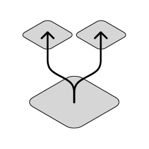

# Polkadot introduction

TODO: talk about parachains overview, threat model, e.g. clarification to avoid misunderstandings with cosmos

Polkadot consists of a main chain called the relay chain and multiple sharded chains called parachains. The relay chain is maintained by validators that are selected through the [NPoS scheme](NPoS/index.md#the-npos-scheme) and is responsible for producing blocks of the relay chain (via [BABE](block-production/Babe.md)) and keeping the state of all the parachains.
These validators need to vote on the consensus, see [GRANDPA](finality.md), over all the parachains blocks. For parachains, there are additional actors called collators and fishermen that are responsible for parachain block production  and reporting invalid parachain blocks respectively. In the figure below an example cut-out of Polkadot with part of the relay chain, one parachain, three validators and five collators are shown.

TODO: make image smaller

Validators are assigned to parachains, which are responsible for validating parachain blockd and keeping them available via the [A&V scheme](Availability_and_Validity.md). Moreover, another feature of Polkadot is enabling interchain messaging among parachains, called [XCMP](XCMP.md).

The security goal of Polkadot is to be Byzantine fault tolerant when the participants are rational. Rewards are given out when validators behave correctly and validators misbehaviour is punished via the [Slashing mechanism](slashing.md). More details on incentives and economics are reviewed [here](./economics/1-token-economics.md).

Furthermore, Polkadot has a decentralised governance scheme that can change any Polkadot design decisions and parameterisation. Details on low-level cryptographic primitives can be found [here](keys/index.md) and Polkadot's networking schemes is in progress with some details being reviewed [here](networking.html).

**For other information regarding the project please refer to the [wiki page](https://wiki.polkadot.network).**

**We also provide implementation level specification of the protocol for the [host](Polkadot-Host-Spec.md) as well as the [runtime](Polkadot-Runtime-Spec.md).**

## High-level properties

This section describes properties (guarantees) that users can expect of Polkadot.

TODO: update, this content was c+p from old website

### State Transition Properties

Polkadot speaking in abstract terms provides a number of connected finalising state machines. Connected means that a state transition of one machine can affect a transition of another machine. The state machines are final, since most networks participants agree on their state after some time. We would also like to enable adding, removing and changing of the state machines as the time goes on to ensure utility.
The research focuses on how to enable having such publicly available system in the face of possible adversarial conditions. The public can use the system by interacting with state machines that they are interested in via the internet. Each state machine can provide different functionalities and behave in different ways (have a different state and state transition scheme).

So let us start with abstract state machines. A state machine has a certain state type and state transition type. As the time goes on, state transitions occur.

The data that determines the state transitions is structured as bundles of transactions - individual small state transitions triggered by the users of the system. Each bundle is called a block. In order to achieve its properties, ensures that those blocks are hash connected forming joint data structure.

### 1 Utility

Each state transition should bring some utility to the system participants. In order to ensure that this is the case:

- state machines should provide some utility to participants
- state transitions processed by these state machines reflect well the state transition needs of participants.

To ensure that the state machines provide utility we should ensure that there is a mechansim that enables participants to decide what state machines should be included and how they should change to reflect participant needs. This mechanism is the [Polkadot governance scheme](https://github.com/paritytech/polkadot/wiki/Governance).

To ensure that useful state transitions are processed by those state machines, we will want to ensure that useful transactions get included in Polkadot blocks. Polkadot will have a transaction fee mechanism on the relay chain to ensure that transactions issued by parties willing to pay a reasonable price for them are included. There will also be a certain portion of each block that is dedicated to certain high-priority transactions, such as misbehaviour reporting. The utility of the parachain state transitions has to be ensured by the state transition function of a given chain.

### 2 Validity

The notion of validity in Polkadot is determined by a state transition validation function (STVF). Each chain in the ecosystem has to have one implemented. In order for all nodes to be able to run this function it is being distributed as deterministic WebAssembly (Wasm) code which can be executed by the Polkadot Host.

The blocks are produced by parachain collators, then they get validated using the STVF by the subset of validators responsible for the given parachain to finally get included in the Polkadot Relay Chain. During this process validators, parachain collators and other parties are free to challenge claims of validity to trigger additional check, these parties are referred to as fishermen. [Read here about parachain validity](Availability_and_Validity.md).

### 3 Finality

Finality of the Polkadot network state machines is achieved via a combination of a block production mechanism with eventual probabilistic consistency ([BABE scheme](block-production/Babe.md)) and [GRANDPA finality gadget](finality.md).

This approach allows for block production (thus transaction confirmations) to be fast, while allowing for as fast as possible economic finality with compact proofs.

### 4 Availability

In order for the critical data from all chains to remain reachable by users and subsequent block producers, Polkadot makes use of an erasure coding based [availability scheme](Availability_and_Validity.md).

### 5 Messaging reliability

Besides ensuring all the above properties for all parachain, a crucial element of Polkadot is that these state machines are able to affect each others state transitions. This is done via the [Cross-Chain Message Passing (XCMP) scheme](XCMP.md).

### 6 Size

To ensure that the state transitions can be processed and stored by the network their size has to be reasonable. Mechanisms such as transaction fees and block limits are there to limit the storage size and computation required for each block.

#### Light client

The protocol is being designed with light client support in mind with existing Substrate implementation supporting one.

### 7 Bandwidth

To ensure usability in realistic network conditions a reasonable bandwidth requirements have to be maintained.
