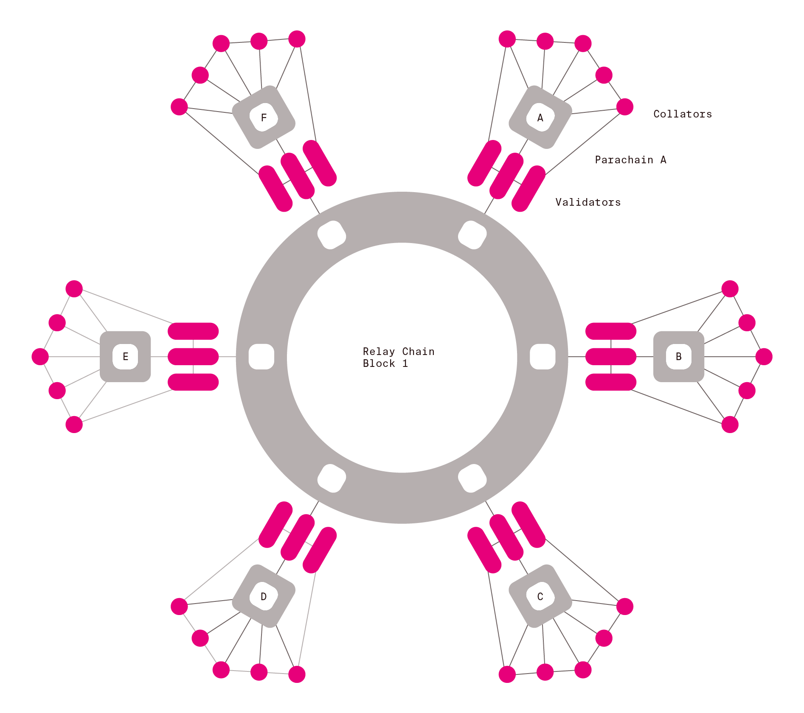
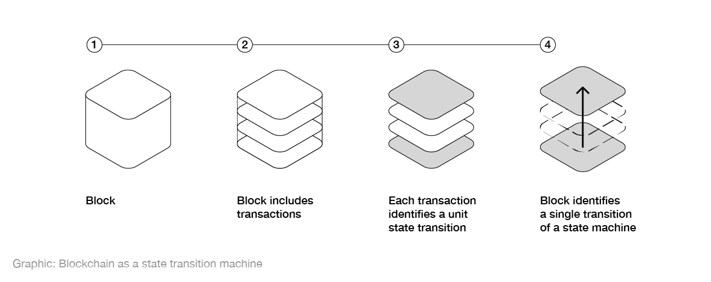
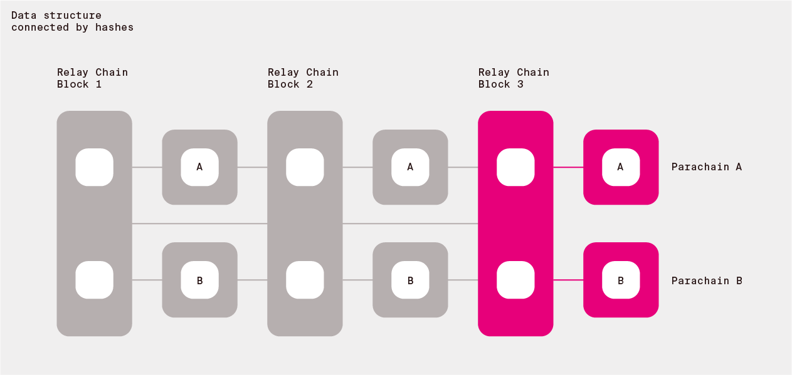

# Polkadot

Polkadot consists of a main chain called the relay chain and multiple sharded chains called parachains. The relay chain is maintained by validators that are selected through the [NPoS scheme](docs/polkadot/NPoS/) and is responsible for producing blocks (via [BABE](polkadot/BABE)) of the relay chain and keeping the state of all the parachains.
These validators need to vote on the consensus over all the parachains, see the consensus scheme called [GRANDPA](https://research.web3.foundation/en/latest/polkadot/GRANDPA.html) for more details.
The security goal of Polkadot is to be Byzantine fault tolerant when the participants are rational see [here](polkadot/Token Economics.md) for more detail on incentives and economics.
For parachains, there are additional actors called collators and fishermen that are responsible for parachain block production  and reporting invalid parachain blocks respectively.
The parachain validators assigned to each parachain validate each parachain block and are responsible to keep it available via the [A&V scheme](polkadot/Availability_and_Validity.md). Moreover, another feature of Polkadot is enabling interchain messaging among parachains, see [XCMP](polkadot/XCMP.md) for more details.
Furthermore, Polkadot has a decentralised governance scheme that can change any Polkadot design decisions and parameterisation.

Polkadot speaking in abstract terms provides a number of connected finalising state machines. Connected means that a state transition of one machine can affect a transition of another machine. The state machines are final, since most networks participants agree on their state after some time. We would also like to enable adding, removing and changing of the state machines as the time goes on to ensure utility.

The research focuses on how to enable having such publicly available system in the face of possible adversarial conditions. The public can use the system by interacting with state machines that they are interested in via the internet. Each state machine can provide different functionalities and behave in different ways (have a different state and state transition scheme).

So let us start with abstract state machines. A state machine has a certain state type and state transition type. As the time goes on, state transitions occur.

The data that determines the state transitions is structured as bundles of transactions - individual small state transitions triggered by the users of the system. Each bundle is called a block. In order to achieve its properties, ensures that those blocks are hash connected forming joint data structure.

## Participants that run the Polkadot network 

## Keys

To identify unique individual participants that will perform duties on the network we use public key cryptography. You can read more about our approach [here](https://research.web3.foundation/en/latest/polkadot/keys/) and see the particular crypto for the first implementation in the [Schnorrkel repo](https://github.com/w3f/schnorrkel).

Validator keys indicated by the staking key are:
 - transport layer: ed25519
 - GRANDPA and consolidated reporting: BLS
 - block production (VRF): Ristretto

## Proof-of-Stake

In order to keep certain parties accountable for ensuring various properties listed below we make sure to be able to punish these participants by taking away some of their funds (Proof-of-Stake). The primary nodes running the network are the validators. To ensure a large set of participants is able to contribute to the security of the network we introduce a Nominated Proof of Stake scheme (NPoS). This scheme allows participants which do not wish to run nodes to be able to help with the validator selection. The current method used to distribute that stake is the [Sequential Phragmén Method](NPoS/index.md).

For Polkadot use Phragmén's method as a fallback, but allow for better solutions to be submitted. As an edge case, if no good solution is submitted, run the slow heuristic which provides a 2-approximation (TODO: publish).

Judging NPoS solutions:

- Check if a submitted solution is locally optimal in the sense of a certain local search procedure. Locally optimal solutions have a fairness property. Thus we only accept solutions that are fair (TODO: publish).
- Among the submissions that observe the first property about fairness, select the one that maximizes the minimum stake of any selected validator. This ensures maximum security threshold for each parachain validator group.

A comprehensive list of misbehaviours that have to be penalized can be found in the [sanctioning sheet](https://docs.google.com/spreadsheets/d/1HSCiAf9pyxUSwojGQzg_pestlS_8yupCOTGnIGSvp9Q/edit?usp=sharing).

## Why not use different sets for different tasks?

Use the same validator set for BABE as for GRANDPA as to avoid paying more in total for block production + finality.

## Desired architectural qualities

* Minimal: Polkadot should have as little functionality as possible.
* Simple: No additional complexity should be present in the base protocol.
* General: Polkadot can be optimized through making the model into which extensions fit as abstract as possible.
* Robust: Polkadot should provide a fundamentally stable base-layer.

For other information regarding the project please refer to the [wiki page](https://wiki.polkadot.network). 

We are working on a implementation level specification of the protocol [here](https://github.com/w3f/polkadot-re-spec).
