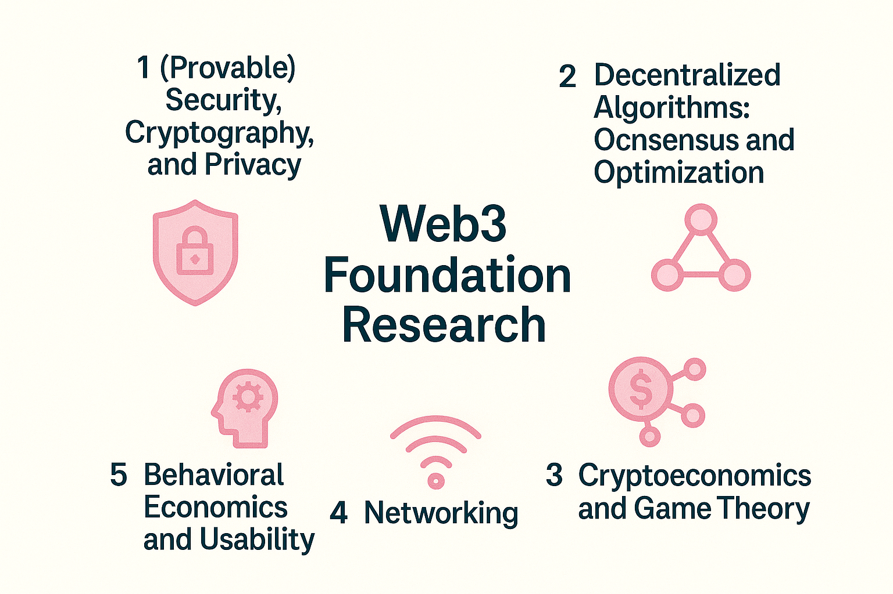

<!-- import DocCardList from '@theme/DocCardList'; -->

Web3 Foundation's research focuses on several areas relevant to decentralized systems, including:

The [research team](team_members) collaborates closely with development groups to ensure its work is practical and impactful for Web3 technologies. One of its key priorities is to analyze existing protocols, design new ones, and provide formal specifications. 

The core research team is based in Zug, Switzerland, with research efforts carried out in collaboration with both industrial initiatives and academic institutions.

Talk to us on Element at #w3f:matrix.org.

<!-- <DocCardList /> -->
