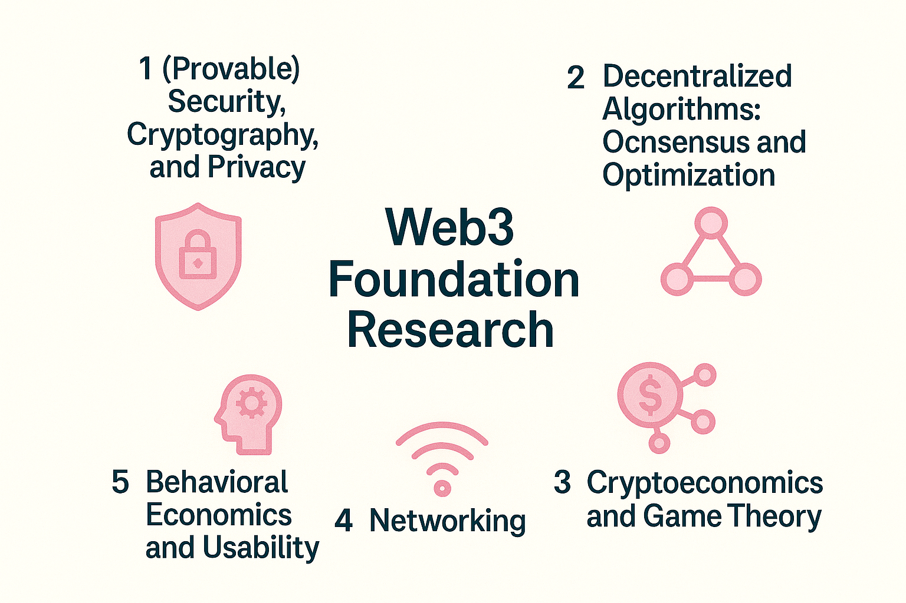

<!-- import DocCardList from '@theme/DocCardList'; -->

<!---->

Parity's research focuses on several areas relevant to decentralized systems, including: (1) networking, (2) cryptoeconomics and game theory, (3) provable security, cryptography, and privacy, (4) behavioral economics and usability, and (5) decentralized algorithms for consensus and optimization.

The [research team](team_members) collaborates closely with development groups to ensure its work is practical and impactful for Web3 technologies. One of its key priorities is to analyze existing protocols, design new ones, and provide formal specifications. 

The core research team's efforts are carried out in collaboration with both industrial initiatives and academic institutions.

Talk to us on Element at:

<!-- <DocCardList /> -->
