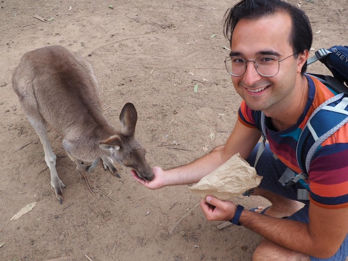

# Leon Groot Bruinderink

Leon joined Web3 Foundation in the beginning of 2020 as a research scientist. His main research areas are verifiable distributed datastructures, messaging protocols and (applied) cryptography. 

**Short Biography:**
Before joining Web3 Foundation, Leon was a PhD student working on post-quantum cryptography at Eindhoven University of Technology, under supervision of Tanja Lange, Daniel J. Bernstein and Andreas Hülsing. His scientific contributions range from theoretical work, like how to model (quantum) attacks, to applied works, including side-channel attacks. He successfully defended his PhD thesis "Attacking Post-Quantum Cryptography" in December 2019. Before his PhD, Leon earned a MSc degree in Industrial and Applied Mathematics from Eindhoven University of Technology. 

**Publications:**

• Differential Fault Attacks on Deterministic Lattice Signatures\
Leon Groot Bruinderink and Peter Pessl\
TCHES 2018-3 ([IACR ePrint](https://eprint.iacr.org/2018/355))

• "HILA5 Pindakaas": On the CCA security of lattice-based encryption with error correction\
Daniel J. Bernstein, Leon Groot Bruinderink, Tanja Lange and Lorenz Panny\
AFRICACRYPT 2018 ([IACR ePrint](https://eprint.iacr.org/2017/1214))

• Post-quantum security of the sponge construction\
Jan Czajkowski, Leon Groot Bruinderink, Andreas Hülsing, Christian Schaffner and Dominique Unruh\
QCRYPT 2017, PQCrypto 2018 ([IACR ePrint](https://eprint.iacr.org/2017/771))

• To BLISS-B or not to be - Attacking strongSwan's Implementation of Post-Quantum Signatures\
Peter Pessl, Leon Groot Bruinderink and Yuval Yarom\
CCS 2017 ([IACR ePrint](https://eprint.iacr.org/2017/490))

• Sliding right into disaster - Left-to-right sliding windows leak \
Daniel J. Bernstein, Joachim Breitner, Daniel Genkin, Leon Groot Bruinderink, Nadia Heninger, Tanja Lange, Christine van Vredendaal and Yuval Yarom\
CHES 2017 ([IACR ePrint](https://eprint.iacr.org/2017/627))

• "Oops, I did it again" - Security of One-Time Signatures under Two-Message Attacks\
Leon Groot Bruinderink and Andreas Hülsing\
SAC 2017 ([IACR ePrint](https://eprint.iacr.org/2016/1042))

• Flush, Gauss, and Reload - A Cache Attack on the BLISS Lattice-Based Signature Scheme\
Leon Groot Bruinderink, Andreas Hülsing, Tanja Lange and Yuval Yarom\
CHES 2016 ([IACR ePrint](https://eprint.iacr.org/2016/300))