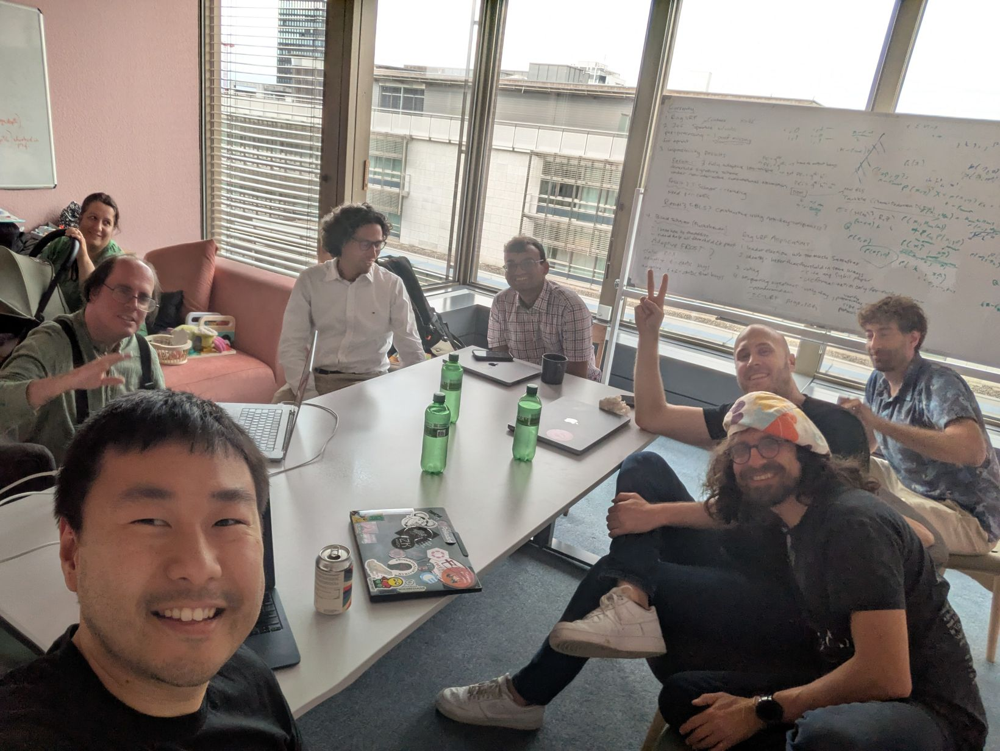

import DocCardList from '@theme/DocCardList';

Alistair Stewart, Andrew Burger, Elizabeth Crites, Jeff Brudges, Jonas Gehrlein, Sergey Vasilyev, Syed Hosseini, Chen-Da Liu-Zhang, and Bhargav Nagaraja Bhatt form the Web3 Foundation’s research dream team. They are the driving force behind its research efforts, contributing to a broad spectrum of topics related to decentralized systems. Explore the links provided to learn more about their individual areas of interest and personal journeys.

<DocCardList />
